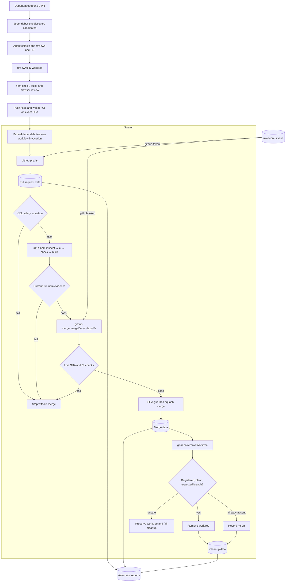
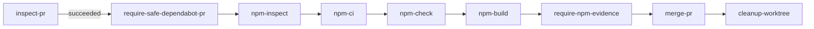
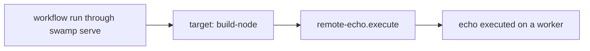

# Swamp System for s11a.com

This document is the operational reference for the Swamp system committed to
this repository. It covers the models, model types, local type extensions,
workflows, vault, data, reports, runtime boundaries, and recovery procedures
used by `s11a.com`.

## Scope

Swamp currently serves three purposes in this repository:

1. Discover, review, safely merge, and clean up local worktrees for Dependabot
   pull requests.
2. Re-run authoritative npm inspect, lifecycle-denied ci, check, and build
   against the exact agent-reviewed commit before a Dependabot merge.
3. Demonstrate dispatching a model method to a remote worker named
   `build-node`.

Swamp does not build, deploy, or host the website. The application remains a
TanStack Start site built with npm and deployed through Vercel/Nitro.

## System Boundary

The Dependabot process deliberately separates judgment from enforcement:

- The agent inspects release notes and diffs, creates an isolated worktree,
  fixes compatibility problems, runs application checks, performs browser
  review, pushes changes, and verifies CI for an exact commit.
- Swamp refreshes the PR state, re-runs npm validation in the fixed review
  worktree, enforces machine-checkable evidence, merges only the reviewed
  commit, removes the matching clean worktree, and stores structured outputs.

The workflow is an execution gate, not an autonomous reviewer. It does not
decide whether a dependency update is semantically safe.



## Repository Layout

| Path                                         | Purpose                                                          | Version controlled |
| -------------------------------------------- | ---------------------------------------------------------------- | ------------------ |
| `.swamp.yaml`                                | Swamp repository identity and managed-tool metadata              | Yes                |
| `AGENTS.md`                                  | Agent operating policy, including the Dependabot runbook         | Yes                |
| `models/`                                    | Persistent model instances referenced by workflows               | Yes                |
| `workflows/`                                 | Declarative workflow DAGs                                        | Yes                |
| `extensions/models/`                         | Local model-type extensions and their Deno tests                 | Yes                |
| `extensions/models/upstream_extensions.json` | Pulled extension versions and checksums                          | Yes                |
| `vaults/`                                    | Vault configuration metadata, not secret values                  | Yes                |
| `.swamp/`                                    | Bundles, run records, data, encrypted secrets, and runtime state | No                 |
| `.swamp-sources.yaml`                        | Developer-specific local extension sources                       | No                 |

The repository ID is `b6ab3626-2e88-49c9-b78d-5b92537dd4c1`.

`tsconfig.json` excludes `extensions/` because these files target Deno and use
`npm:` imports. They are validated with Swamp's bundled Deno rather than the
application's TypeScript compiler.

## Component Inventory

### Models

A model is a persistent, named instance of a model type. Workflows refer to
model names, not implementation files.

| Model            | Type                       | Purpose                                                                 | Definition                                            |
| ---------------- | -------------------------- | ----------------------------------------------------------------------- | ----------------------------------------------------- |
| `dependabot-prs` | `@sntxrr/dependabot-sweep` | Find open Dependabot PRs and classify repositories as live or abandoned | `models/@sntxrr/dependabot-sweep/dependabot-prs.yaml` |
| `github-prs`     | `@bixu/github/pull`        | Retrieve typed GitHub pull-request snapshots                            | `models/@bixu/github/pull/github-prs.yaml`            |
| `github-merge`   | `@hivemq/github/merge`     | Execute GitHub merge operations using the configured owner and token    | `models/@hivemq/github/merge/github-merge.yaml`       |
| `git-repo`       | `@swamp/git`               | Perform structured Git operations against the current repository        | `models/@swamp/git/git-repo.yaml`                     |
| `s11a-npm`       | `@funsaized/npm/project`   | Validate the fixed Dependabot review worktree and persist npm evidence  | `models/@funsaized/npm/project/s11a-npm.yaml`         |
| `remote-echo`    | `command/shell`            | One-off remote-worker demonstration                                     | `models/command/shell/remote-echo.yaml`               |

List the installed models:

```bash
swamp model search --json
```

Inspect or validate a model:

```bash
swamp model get git-repo --json
swamp model validate git-repo --json
```

### Upstream Types

The following registry extensions supply the upstream model types:

| Extension                  | Package version | Used type                  | Model `typeVersion` |
| -------------------------- | --------------- | -------------------------- | ------------------- |
| `@sntxrr/dependabot-sweep` | `2026.08.13.1`  | `@sntxrr/dependabot-sweep` | `2026.08.13.1`      |
| `@bixu/github`             | `2026.05.05.1`  | `@bixu/github/pull`        | `2026.03.09.1`      |
| `@hivemq/github/merge`     | `2026.06.01.70` | `@hivemq/github/merge`     | `2026.05.21.1`      |
| `@swamp/git`               | `2026.08.25.1`  | `@swamp/git`               | `2026.08.25.1`      |
| `@funsaized/npm`           | `2026.08.26.1`  | `@funsaized/npm/project`   | `2026.08.26.1`      |

The versions and integrity checksums are recorded in
`extensions/models/upstream_extensions.json`. Pulled source and compiled bundles
live under ignored `.swamp/` runtime state.

Inspect a type and all locally added methods:

```bash
swamp model type describe @hivemq/github/merge --json
swamp model type describe @swamp/git --json
```

Verify extension registration:

```bash
swamp doctor extensions --json
```

### Local Type Extensions

The project extends existing domain types instead of creating parallel GitHub
or Git integrations.

#### `mergeDependabotPr`

`extensions/models/dependabot_merge.ts` extends `@hivemq/github/merge` with a
single method:

```text
mergeDependabotPr(repo, pullNumber, expectedHeadSha)
```

Before mutation, the method requires:

- The PR is open.
- The PR is not a draft.
- The author is exactly `dependabot[bot]`.
- The base branch is exactly `master`.
- The live PR head SHA equals `expectedHeadSha`.
- At least one GitHub check run exists.
- GitHub's `total_count` equals the number of returned check runs, preventing a
  partial page from being treated as complete.
- Every returned check run is completed with conclusion `success`.
- A check named `validate` exists.
- The combined commit status is successful when statuses are present.

The final GitHub merge request is a squash merge guarded by the same head SHA.
The method writes a `merge` resource containing the merge commit SHA, reviewed
head SHA, owner, repository, base branch, result message, and timestamp.

Tests are in `extensions/models/dependabot_merge_test.ts`.

#### `removeWorktree`

`extensions/models/git_worktree.ts` extends `@swamp/git` with:

```text
removeWorktree(worktreePath, expectedBranch)
```

The method is fail-closed:

- It refuses the primary repository worktree.
- An existing path must be registered by `git worktree list --porcelain`.
- A registered path must exist on disk.
- The branch must equal `expectedBranch`.
- The worktree must have an empty `git status --porcelain` result.
- Removal never uses `--force`.
- An already-absent, unregistered path is an idempotent no-op.

The method writes an infinite-lifetime `worktreeRemoval` resource containing the
path, branch, removal result, and timestamp. Tests cover clean removal,
idempotent replay, primary-worktree refusal, and dirty-worktree refusal in
`extensions/models/git_worktree_test.ts`.

The missing upstream capability is tracked at
<https://swamp-club.com/lab/1836>.

## Vault and Secrets

The committed vault configuration is:

```text
Vault: my-secrets
Type: local_encryption
Definition: vaults/local_encryption/267765b7-9058-42a2-a301-bbfb788b6d80.yaml
```

It currently has two keys:

| Key                       | Consumer                                                               |
| ------------------------- | ---------------------------------------------------------------------- |
| `github-token`            | `dependabot-prs`, `github-prs`, and `github-merge`                     |
| `worker-token-build-node` | Remote worker authentication outside the committed workflow definition |

Model definitions retrieve the GitHub token at runtime:

```text
${{ vault.get("my-secrets", "github-token") }}
```

Secret values are not committed. The local-encryption key, ciphertext, and
secret metadata live under ignored `.swamp/` state.

Store the GitHub token interactively on a new machine:

```bash
swamp vault put my-secrets github-token
```

Inspect metadata without revealing values:

```bash
swamp vault get my-secrets --json
swamp vault list-keys my-secrets --json
swamp vault inspect my-secrets github-token --json
swamp vault audit-trail --vault my-secrets --json
```

Do not use `swamp vault read-secret` in logs, documentation, or agent output.

The committed local vault configuration contains a machine-specific `base_dir`.
A clone at a different path must update the vault configuration before storing
or reading local secrets:

```bash
swamp vault edit my-secrets
```

## Dependabot Discovery

Discovery is separate from the merge workflow so the agent can choose one PR at
a time.

Run the sweep:

```bash
swamp model method run dependabot-prs sweep
```

The model searches repositories owned by the `funsaized` user. Its allowlist
marks `s11a.com` as live regardless of activity heuristics; it does not restrict
the sweep to that repository. The sweep can therefore return Dependabot PRs for
other repositories owned by `funsaized`, which the agent must ignore when
working in this repository.

The method writes an infinite-lifetime `sweep` resource named `current` with a
version garbage-collection count of 30. It also writes one infinite-lifetime
`repository` resource per repository, named by the bare repository name, with a
version garbage-collection count of 30.

Query the results:

```bash
swamp data list dependabot-prs --json
swamp data query 'modelName == "dependabot-prs"' --json
```

Discovery does not approve or merge anything.

## Dependabot Review Workflow

The current workflow is `dependabot-review`, defined in
`workflows/workflow-dependabot-review.yaml`.

### Trigger

The workflow has no schedule, webhook, or automatic trigger. It is manually
invoked only after the agent completes the review procedure in `AGENTS.md`.

Required inputs:

| Input             | Constraint                                  | Meaning                                      |
| ----------------- | ------------------------------------------- | -------------------------------------------- |
| `pullRequest`     | Positive integer                            | Selected Dependabot PR number                |
| `reviewedHeadSha` | Exactly 40 lowercase hexadecimal characters | Commit that passed final CI and local review |
| `worktreePath`    | Exactly `.worktrees/dependabot-review`      | Fixed clean `review/pr-<number>` worktree    |

Invocation:

```bash
swamp workflow validate dependabot-review --json

swamp workflow run dependabot-review \
  --input pullRequest=<number> \
  --input reviewedHeadSha=<40-character-sha> \
  --input worktreePath=.worktrees/dependabot-review
```

Calling the workflow is the approval to merge. Do not call GitHub merge model
methods directly.

### Pre-Workflow Review

Before invocation, the agent must:

1. Confirm CI for the current PR head SHA.
2. Inspect the dependency diff and release notes; reject unrelated or unsafe
   changes.
3. Create `.worktrees/dependabot-review` on `review/pr-<number>`.
4. Merge `origin/master` into the review branch.
5. Run `npm ci`, `npm run check`, and `npm run build`.
6. Commit and push any resulting merge before collecting final evidence.
7. Test `/`, `/articles`, `/about`, and the newest article linked from
   `/articles` with Playwright at desktop and mobile widths.
8. Reject console errors, failed requests, broken navigation, horizontal
   overflow, and rendering defects.
9. Push any compatibility fix and wait for CI on the new SHA.
10. Stop after two failed fix attempts or when a fix would broaden scope beyond
    compatibility with the dependency update.
11. Ensure the worktree is clean.

The browser review may ignore only the known TanStack query-stream error
containing `Cannot read properties of undefined (reading 'mutations')` while
this site does not use TanStack Query.

### Workflow DAG



#### 1. `inspect-pr`

Calls `github-prs.list` with repository `s11a.com` and state `open`. This
refreshes GitHub state and writes one typed `pull` resource per returned PR.

#### 2. `require-safe-dependabot-pr`

Uses CEL over the data produced by `inspect-pr`:

```cel
data.findBySpec("github-prs", "pull").exists(pr,
  pr.attributes.number == inputs.pullRequest &&
  pr.attributes.user == "dependabot[bot]" &&
  pr.attributes.state == "open" &&
  !pr.attributes.draft &&
  !pr.attributes.merged &&
  pr.attributes.base == "master")
```

Failure stops the workflow before mutation.

#### 3. npm validation and evidence

`npm-inspect`, `npm-ci`, `npm-check`, and `npm-build` call `s11a-npm` in
sequence, each with `expectedGitHead=reviewedHeadSha`. The model executes in
`.worktrees/dependabot-review`, denies install lifecycle scripts, allows only
`check` and `build`, and requires clean tracked Git state.

`require-npm-evidence` inspects only resources produced by the current workflow
run. It requires four successful invocations, matching before/after Git heads,
unchanged package and lockfile hashes, clean tracked state, and lifecycle policy
`deny`.

#### 4. `merge-pr`

Calls `github-merge.mergeDependabotPr` with the selected PR and exact reviewed
SHA. The method performs the live SHA, identity, base-branch, check-run, and
commit-status validation described above before issuing the squash merge.

#### 5. `cleanup-worktree`

Runs only after `merge-pr` succeeds. It calls `git-repo.removeWorktree` with:

```text
worktreePath = workflow input
expectedBranch = review/pr-<pullRequest>
```

The local branch is retained. Only the worktree registration and directory are
removed.

### Partial Success

Merge and cleanup are sequential external mutations, not a transaction. If the
merge succeeds but cleanup refuses a dirty or mismatched worktree:

- The PR remains merged.
- The worktree remains intact for recovery.
- The workflow reports failure at `cleanup-worktree`.
- Inspect the merge data before taking further action.
- Clean or preserve the local changes, then resume from cleanup rather than
  rerunning the merge.

```bash
swamp report get @swamp/workflow-summary \
  --workflow dependabot-review \
  --json

swamp workflow resume dependabot-review --from cleanup-worktree
```

## Data Model

Method executions write versioned data artifacts. Do not inspect `.swamp/`
files directly; use `swamp data` commands.

### Resource Names

| Producer                         | Spec              | Data name                      |
| -------------------------------- | ----------------- | ------------------------------ |
| `dependabot-prs.sweep`           | `sweep`           | `current`                      |
| `dependabot-prs.sweep`           | `repository`      | `<bare repository name>`       |
| `github-prs.list`                | `pull`            | `s11a.com-<PR number>`         |
| `github-merge.mergeDependabotPr` | `merge`           | `<PR number>`                  |
| `git-repo.removeWorktree`        | `worktreeRemoval` | `worktree-<worktree basename>` |
| `s11a-npm.*`                     | `invocation`      | `invocation-<operation>-<run>` |
| `s11a-npm.inspect`               | `project`         | `project-current`              |

Typical retrieval:

```bash
swamp data get github-prs s11a.com-290 --json
swamp data get github-merge 290 --json
swamp data get git-repo worktree-pr-290 --json
```

List or query workflow outputs:

```bash
swamp data list --workflow dependabot-review --json

swamp data query \
  'tags.workflow == "dependabot-review" && tags.type == "resource"' \
  --json
```

Query successful merge resources across runs:

```bash
swamp data query \
  'modelName == "github-merge" && attributes.merged == true' \
  --json
```

Inspect version history:

```bash
swamp data versions github-prs s11a.com-290 --json
```

Within workflows, prefer CEL references to existing data instead of refetching:

```cel
data.latest("github-merge", "290").attributes.sha
```

### Data Lifetime

The PR, merge, and worktree-removal resources have infinite lifetime with
bounded version garbage-collection counts defined by their types. Runtime data
is local because `.swamp/` is ignored. A team-wide audit history requires a
shared Swamp datastore or Swamp server; Git alone shares definitions, not run
data.

## Reports and Run History

Swamp automatically creates method summaries after model methods and workflow
summary and verification-attestation reports after workflows.

List workflow runs:

```bash
swamp workflow history search --json
```

Get the latest run and logs:

```bash
swamp workflow history get dependabot-review --json
swamp workflow history logs dependabot-review --json
```

Retrieve reports:

```bash
swamp report get @swamp/workflow-summary \
  --workflow dependabot-review \
  --json

swamp report get @swamp/verification-attestation \
  --workflow dependabot-review \
  --json

swamp report get @swamp/method-summary \
  --model github-merge \
  --json
```

The successful PR `#290` run predates the cleanup step and therefore contains
three steps and no `worktreePath` input. Current and future runs use the
four-step workflow documented here.

## Failure Recovery

### PR Head Changed

If `mergeDependabotPr` reports that the PR head changed, discard all previous CI
and browser evidence. Restart review for the new SHA. Do not retry with the old
SHA.

### Checks Missing, Pending, or Failed

Inspect the generated method and workflow reports before changing definitions or
retrying:

```bash
swamp report get @swamp/method-summary --model github-merge --json
swamp report get @swamp/workflow-summary --workflow dependabot-review --json
```

Wait for GitHub checks or fix the PR branch, rerun all review gates, and invoke a
new workflow run with the new exact SHA.

### Cleanup Refused

Do not force-remove the worktree. Inspect and preserve local changes. Once the
worktree is clean and still on `review/pr-<number>`, resume from
`cleanup-worktree`.

### Method or Workflow Lock Appears Stale

```bash
swamp run history --active
swamp run doctor
```

Use `swamp run doctor --fix` only after reviewing the diagnosis.

## Remote Worker Demo

`remote-demo` is independent of Dependabot review. It contains one job and one
step:



Run it with:

```bash
swamp workflow validate remote-demo --json
swamp workflow run remote-demo --server ws://<orchestrator>:4000
```

The workflow YAML targets `build-node`, so it cannot run as a local workflow.
`swamp serve` must be running as the orchestrator and an enrolled worker named
`build-node` must be connected. Worker registration and connectivity are
runtime concerns and are not committed in this repository. The
`worker-token-build-node` vault key supports that external setup. The recorded
demo run was triggered through the API/orchestrator.

Representative worker enrollment:

```bash
swamp worker token create build-node --duration 1h

swamp worker connect ws://<orchestrator>:4000 \
  --token <name>.<secret> \
  --cache-dir <persistent-worker-cache>
```

`remote-echo` is intentionally a one-off `command/shell` demonstration. Do not
copy this pattern for GitHub, cloud, API, or CLI integrations. Search for and use
a typed model extension instead.

## New Clone Bootstrap

The committed definitions are not sufficient by themselves because extension
bundles and secret values are intentionally ignored.

1. Install the project dependencies and ensure the `swamp` CLI is available.
2. Confirm the repository is recognized with `swamp model search --json`.
3. Restore the recorded extension packages from the committed lockfile.
4. Verify extension health.
5. Update the local vault `base_dir` if the clone path differs.
6. Store the GitHub token interactively.
7. Validate all persistent models and workflows.
8. Run application and extension checks.

```bash
npm ci

swamp extension install

swamp doctor extensions --json
swamp vault edit my-secrets
swamp vault put my-secrets github-token

swamp model validate dependabot-prs --json
swamp model validate github-prs --json
swamp model validate github-merge --json
swamp model validate git-repo --json
swamp model validate remote-echo --json
swamp workflow validate dependabot-review --json
swamp workflow validate remote-demo --json
```

`swamp extension install` restores the versions recorded in
`extensions/models/upstream_extensions.json`. Use `swamp extension pull` only
when deliberately adding or upgrading an extension, and review the lockfile
change before accepting it.

## Validation Commands

Application validation:

```bash
npm run check
npm run build
```

Local extension validation:

```bash
~/.swamp/deno/deno fmt --check extensions/models/*.ts

~/.swamp/deno/deno check \
  extensions/models/dependabot_merge.ts \
  extensions/models/dependabot_merge_test.ts \
  extensions/models/git_worktree.ts \
  extensions/models/git_worktree_test.ts

~/.swamp/deno/deno test \
  --allow-net \
  --allow-run=git \
  --allow-read \
  --allow-write \
  extensions/models/dependabot_merge_test.ts \
  extensions/models/git_worktree_test.ts
```

Swamp validation:

```bash
swamp doctor extensions --json
swamp model validate git-repo --json
swamp model validate s11a-npm --json
swamp workflow validate dependabot-review --json
```

## Security Properties and Limits

- Secrets are referenced through the vault and are not committed.
- The final merge is guarded by the exact reviewed SHA, preventing a changed PR
  from reusing old evidence.
- PR identity, draft state, base branch, checks, and combined status are
  revalidated immediately before merge.
- Worktree removal is branch-bound, clean-only, secondary-only, and never
  forced.
- npm merge evidence is tied to the reviewed SHA, produced in the current
  workflow run, lifecycle-denied for installation, and checked for manifest and
  tracked-worktree drift.
- `github-merge` still exposes upstream generic merge methods because the local
  method extends an existing type. Repository policy forbids calling GitHub
  merge model methods directly; use `dependabot-review`.
- Playwright evidence remains agent-managed rather than a Swamp model resource.
- A generic verification attestation may not populate its commit and branch
  subject from workflow inputs. The exact reviewed head remains available in
  workflow inputs and the merge resource.
- Runtime data and encrypted local-vault values are machine-local unless a
  shared datastore and vault backend are configured.
- There is no automatic Dependabot trigger. Human or agent invocation remains
  the explicit approval boundary.

## Operating Rules

- Search registry extensions and installed types before adding automation.
- Prefer official `@swamp/*` extensions, then verified community extensions.
- Extend a suitable type when it lacks one method; do not bypass it with shell
  scripts.
- Use CEL and existing model data rather than refetching known state.
- Inspect model state before destructive methods.
- Inspect generated reports after failures before retrying.
- Do not merge a Dependabot PR outside `dependabot-review`.
- Do not force worktree cleanup.
- Do not commit `.swamp/`, `.swamp-sources.yaml`, tokens, ciphertext, or local
  encryption keys.
