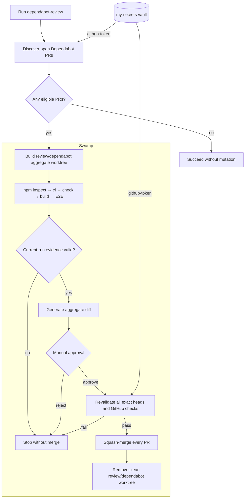
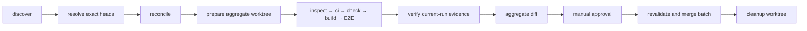
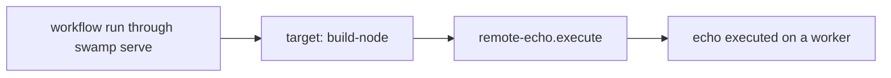

# Swamp System for s11a.com

This document is the operational reference for the Swamp system committed to
this repository. It covers the models, model types, local type extensions,
workflows, vault, data, reports, runtime boundaries, and recovery procedures
used by `s11a.com`.

## Scope

Swamp currently serves three purposes in this repository:

1. Discover all open `s11a.com` Dependabot pull requests and aggregate their
   exact heads in one local worktree.
2. Run authoritative npm inspect, lifecycle-denied ci, check, build, and
   Playwright gates before manually approved exact-SHA squash merges.
3. Demonstrate dispatching a model method to a remote worker named
   `build-node`.

Swamp does not build, deploy, or host the website. The application remains a
TanStack Start site built with npm and deployed through Vercel/Nitro.

## System Boundary

The Dependabot process deliberately separates judgment from enforcement:

- Swamp discovers and reconciles eligible PRs, creates the aggregate worktree,
  runs npm and browser validation, and suspends at a manual approval step.
- The approver inspects dependency release notes and the generated aggregate
  diff. Approval authorizes only the exact heads already validated.
- Swamp revalidates every live head and GitHub check, squash-merges the batch,
  removes the clean worktree, and stores structured outputs.

The workflow is an execution gate, not an autonomous reviewer. It does not
decide whether a dependency update is semantically safe.



## Repository Layout

| Path                                         | Purpose                                                          | Version controlled |
| -------------------------------------------- | ---------------------------------------------------------------- | ------------------ |
| `.swamp.yaml`                                | Swamp repository identity and managed-tool metadata              | Yes                |
| `AGENTS.md`                                  | Agent operating policy, including the Dependabot runbook         | Yes                |
| `models/`                                    | Persistent model instances referenced by workflows               | Yes                |
| `workflows/`                                 | Declarative workflow DAGs                                        | Yes                |
| `extensions/models/`                         | Local model-type extensions and their Deno tests                 | Yes                |
| `extensions/models/upstream_extensions.json` | Pulled extension versions and checksums                          | Yes                |
| `vaults/`                                    | Vault configuration metadata, not secret values                  | Yes                |
| `.swamp/`                                    | Bundles, run records, data, encrypted secrets, and runtime state | No                 |
| `.swamp-sources.yaml`                        | Developer-specific local extension sources                       | No                 |

The repository ID is `b6ab3626-2e88-49c9-b78d-5b92537dd4c1`.

`tsconfig.json` excludes `extensions/` because these files target Deno and use
`npm:` imports. They are validated with Swamp's bundled Deno rather than the
application's TypeScript compiler.

## Component Inventory

### Models

A model is a persistent, named instance of a model type. Workflows refer to
model names, not implementation files.

| Model            | Type                       | Purpose                                                                 | Definition                                            |
| ---------------- | -------------------------- | ----------------------------------------------------------------------- | ----------------------------------------------------- |
| `dependabot-prs` | `@sntxrr/dependabot-sweep` | Find open Dependabot PRs and classify repositories as live or abandoned | `models/@sntxrr/dependabot-sweep/dependabot-prs.yaml` |
| `github-prs`     | `@bixu/github/pull`        | Retrieve typed GitHub pull-request snapshots                            | `models/@bixu/github/pull/github-prs.yaml`            |
| `github-merge`   | `@hivemq/github/merge`     | Execute GitHub merge operations using the configured owner and token    | `models/@hivemq/github/merge/github-merge.yaml`       |
| `git-repo`       | `@swamp/git`               | Perform structured Git operations against the current repository        | `models/@swamp/git/git-repo.yaml`                     |
| `s11a-npm`       | `@funsaized/npm/project`   | Validate the fixed Dependabot review worktree and persist npm evidence  | `models/@funsaized/npm/project/s11a-npm.yaml`         |
| `remote-echo`    | `command/shell`            | One-off remote-worker demonstration                                     | `models/command/shell/remote-echo.yaml`               |

List the installed models:

```bash
swamp model search --json
```

Inspect or validate a model:

```bash
swamp model get git-repo --json
swamp model validate git-repo --json
```

### Upstream Types

The following registry extensions supply the upstream model types:

| Extension                  | Package version | Used type                  | Model `typeVersion` |
| -------------------------- | --------------- | -------------------------- | ------------------- |
| `@sntxrr/dependabot-sweep` | `2026.08.13.1`  | `@sntxrr/dependabot-sweep` | `2026.08.13.1`      |
| `@bixu/github`             | `2026.05.05.1`  | `@bixu/github/pull`        | `2026.03.09.1`      |
| `@hivemq/github/merge`     | `2026.06.01.70` | `@hivemq/github/merge`     | `2026.05.21.1`      |
| `@swamp/git`               | `2026.08.25.1`  | `@swamp/git`               | `2026.08.25.1`      |
| `@funsaized/npm`           | `2026.08.26.1`  | `@funsaized/npm/project`   | `2026.08.26.1`      |

The versions and integrity checksums are recorded in
`extensions/models/upstream_extensions.json`. Pulled source and compiled bundles
live under ignored `.swamp/` runtime state.

Inspect a type and all locally added methods:

```bash
swamp model type describe @hivemq/github/merge --json
swamp model type describe @swamp/git --json
```

Verify extension registration:

```bash
swamp doctor extensions --json
```

### Local Type Extensions

The project extends existing domain types instead of creating parallel GitHub
or Git integrations.

#### Dependabot inspection and merge

`extensions/models/dependabot_merge.ts` extends `@hivemq/github/merge` with a
small fan-out API:

```text
inspectDependabotPrs(repo, pullNumbers)
mergeDependabotPr(repo, pullNumber, expectedHeadSha)
mergeDependabotPrs(repo, baseSha, pullRequests)
```

`inspectDependabotPrs` resolves eligible PR numbers to exact head SHAs and
writes the `dependabot-queue` resource. The batch merge method validates every
PR before starting any merge. Each PR must satisfy:

- The PR is open.
- The PR is not a draft.
- The author is exactly `dependabot[bot]`.
- The base branch is exactly `master`.
- The live PR head SHA equals `expectedHeadSha`.
- GitHub reports the PR as mergeable.
- At least one GitHub check run exists.
- GitHub's `total_count` equals the number of returned check runs, preventing a
  partial page from being treated as complete.
- Every returned check run is completed with conclusion `success`.
- A check named `validate` exists.
- The combined commit status is successful when statuses are present.

The batch method also requires the live `master` SHA to equal the tested base
before mutation and before each merge. Each final request is a squash merge
guarded by the same head SHA, and its resulting Git tree must equal the matching
locally recorded squash tree. The methods write one `merge` resource per PR.

Tests are in `extensions/models/dependabot_merge_test.ts`.

#### Aggregate worktree preparation and cleanup

`extensions/models/git_worktree.ts` extends `@swamp/git` with:

```text
prepareDependabotWorktree(pullNumbers, expectedHeadShas)
removeWorktree(worktreePath, expectedBranch)
```

`prepareDependabotWorktree` fetches every exact `refs/pull/<number>/head`,
verifies each SHA, recreates `.worktrees/dependabot-review` at current
`origin/master`, squash-merges and commits each head into `review/dependabot`,
records every intermediate tree, requires clean Git state, and writes the
`dependabot-aggregate` resource.

Cleanup is fail-closed:

- It refuses the primary repository worktree.
- An existing path must be registered by `git worktree list --porcelain`.
- A registered path must exist on disk.
- The branch must equal `expectedBranch`.
- The worktree must have an empty `git status --porcelain` result.
- Removal never uses `--force`.
- An already-absent, unregistered path is an idempotent no-op.

It writes an infinite-lifetime `worktreeRemoval` resource containing the
path, branch, removal result, and timestamp. Tests cover clean removal,
idempotent replay, primary-worktree refusal, dirty-worktree refusal, and
aggregate preparation in
`extensions/models/git_worktree_test.ts`.

The missing upstream capability is tracked at
<https://swamp-club.com/lab/1836>.

## Vault and Secrets

The committed vault configuration is:

```text
Vault: my-secrets
Type: local_encryption
Definition: vaults/local_encryption/267765b7-9058-42a2-a301-bbfb788b6d80.yaml
```

It currently has two keys:

| Key                       | Consumer                                                               |
| ------------------------- | ---------------------------------------------------------------------- |
| `github-token`            | `dependabot-prs`, `github-prs`, and `github-merge`                     |
| `worker-token-build-node` | Remote worker authentication outside the committed workflow definition |

Model definitions retrieve the GitHub token at runtime:

```text
${{ vault.get("my-secrets", "github-token") }}
```

Secret values are not committed. The local-encryption key, ciphertext, and
secret metadata live under ignored `.swamp/` state.

Store the GitHub token interactively on a new machine:

```bash
swamp vault put my-secrets github-token
```

Inspect metadata without revealing values:

```bash
swamp vault get my-secrets --json
swamp vault list-keys my-secrets --json
swamp vault inspect my-secrets github-token --json
swamp vault audit-trail --vault my-secrets --json
```

Do not use `swamp vault read-secret` in logs, documentation, or agent output.

The committed local vault configuration contains a machine-specific `base_dir`.
A clone at a different path must update the vault configuration before storing
or reading local secrets:

```bash
swamp vault edit my-secrets
```

## Dependabot Discovery

The review workflow starts with a fresh discovery sweep. The model can also be
run independently for diagnostics:

Run the sweep:

```bash
swamp model method run dependabot-prs sweep
```

The model searches repositories owned by the `funsaized` user. Its allowlist
marks `s11a.com` as live regardless of activity heuristics; it does not restrict
the sweep to that repository. The workflow reconciles only the `s11a.com`
result with a fresh GitHub PR listing.

The method writes an infinite-lifetime `sweep` resource named `current` with a
version garbage-collection count of 30. It also writes one infinite-lifetime
`repository` resource per repository, named by the bare repository name, with a
version garbage-collection count of 30.

Query the results:

```bash
swamp data list dependabot-prs --json
swamp data query 'modelName == "dependabot-prs"' --json
```

Discovery does not approve or merge anything.

## Dependabot Review Workflow

The current workflow is `dependabot-review`, defined in
`workflows/workflow-dependabot-review.yaml`.

### Trigger

The workflow has no schedule, webhook, or automatic trigger. It is manually
invoked with no inputs:

```bash
swamp workflow validate dependabot-review --json
swamp workflow run dependabot-review --json
```

Do not call its GitHub or Git mutation methods directly. No eligible PRs is a
successful no-op: discovery and reconciliation run, while worktree, npm,
approval, merge, and cleanup steps skip.

Job concurrency is `1`. Every queue, worktree, and npm CEL reference is bound to
the current run rather than an older `data.latest` artifact. Do not overlap
workflow runs because they intentionally share one fixed aggregate worktree.

### Workflow DAG



#### 1. Discovery and reconciliation

`dependabot-prs.sweep` discovers candidates and must report a complete,
non-truncated sweep. `github-prs.list` independently lists open `s11a.com` PRs.
`github-merge.inspectDependabotPrs` revalidates Dependabot identity, open state,
draft state, and `master` base while resolving exact 40-character head SHAs.

The reconciliation assertion requires both discovery sources to contain the
same eligible PR numbers. A disagreement fails before local or remote mutation.

#### 2. Aggregate worktree

`git-repo.prepareDependabotWorktree` recreates
`.worktrees/dependabot-review` on `review/dependabot` from current
`origin/master`, fetches each PR ref, verifies every expected SHA, applies
sequential squash merges in PR-number order, requires clean Git state, and
records the base SHA, aggregate SHA, source PR SHAs, and intermediate trees.

#### 3. npm validation and evidence

`npm-inspect`, `npm-ci`, `npm-check`, `npm-build`, and `npm-e2e` call `s11a-npm`
in sequence with the aggregate SHA. The model executes in the fixed worktree,
denies install lifecycle scripts, allows only `check`, `build`, and `test:e2e`,
sets `CI=true` so Playwright starts the tested worktree's own server, and
requires clean tracked Git state.

`require-npm-evidence` inspects only resources produced by the current workflow
run. It requires all five successful invocations, matching before/after Git
heads, unchanged package and lockfile hashes, clean tracked state, and lifecycle
policy `deny`.

#### 4. Diff and approval

The workflow generates a structured diff from the recorded base SHA to the
aggregate SHA, then suspends at `approve-aggregate` for up to 24 hours. Inspect
every dependency diff and release note before approving.

```bash
swamp workflow approvals --json
swamp workflow approve dependabot-review approve-aggregate --run <run-id>
swamp workflow resume dependabot-review --run <run-id> --json
```

Reject unsafe or unrelated changes instead:

```bash
swamp workflow reject dependabot-review approve-aggregate \
  --run <run-id> \
  --reason "unsafe dependency change"
```

#### 5. Merge and cleanup

After approval, `github-merge.mergeDependabotPrs` revalidates every live exact
head, Dependabot identity, base branch, required `validate` check, all returned
check runs, combined status, and mergeability before starting the batch. It
requires `master` to remain on the tested sequence, performs SHA-guarded squash
merges, and verifies each resulting Git tree before continuing.

`git-repo.removeWorktree` runs only after all merges succeed, with:

```text
worktreePath = .worktrees/dependabot-review
expectedBranch = review/dependabot
```

The local branch is retained. Only the worktree registration and directory are
removed.

### Failure and Partial Success

The workflow is not a transaction. If a later batch merge fails after an earlier
one succeeds, the successful merge remains. A cleanup refusal also preserves
the worktree. Inspect reports and merge resources before retrying.

Validation failures leave the aggregate worktree for diagnosis. Apply the
smallest compatibility fix to the affected PR branch, push it, wait for GitHub
checks on the new SHA, and start a new workflow run; preparation safely replaces
a clean prior aggregate worktree.

```bash
swamp report get @swamp/workflow-summary \
  --workflow dependabot-review \
  --json
```

## Data Model

Method executions write versioned data artifacts. Do not inspect `.swamp/`
files directly; use `swamp data` commands.

### Resource Names

| Producer                             | Spec                 | Data name                      |
| ------------------------------------ | -------------------- | ------------------------------ |
| `dependabot-prs.sweep`               | `sweep`              | `current`                      |
| `dependabot-prs.sweep`               | `repository`         | `<bare repository name>`       |
| `github-prs.list`                    | `pull`               | `s11a.com-<PR number>`         |
| `github-merge.inspectDependabotPrs`  | `dependabotQueue`    | `dependabot-queue`             |
| `github-merge.mergeDependabotPrs`    | `merge`              | `<PR number>`                  |
| `git-repo.prepareDependabotWorktree` | `dependabotWorktree` | `dependabot-aggregate`         |
| `git-repo.removeWorktree`            | `worktreeRemoval`    | `worktree-<worktree basename>` |
| `s11a-npm.*`                         | `invocation`         | `invocation-<operation>-<run>` |
| `s11a-npm.inspect`                   | `project`            | `project-current`              |

Typical retrieval:

```bash
swamp data get github-prs s11a.com-290 --json
swamp data get github-merge dependabot-queue --json
swamp data get git-repo dependabot-aggregate --json
swamp data get github-merge 290 --json
swamp data get git-repo worktree-dependabot-review --json
```

List or query workflow outputs:

```bash
swamp data list --workflow dependabot-review --json

swamp data query \
  'tags.workflow == "dependabot-review" && tags.type == "resource"' \
  --json
```

Query successful merge resources across runs:

```bash
swamp data query \
  'modelName == "github-merge" && attributes.merged == true' \
  --json
```

Inspect version history:

```bash
swamp data versions github-prs s11a.com-290 --json
```

Within workflows, prefer CEL references to existing data instead of refetching:

```cel
data.latest("github-merge", "290").attributes.sha
```

### Data Lifetime

The queue, aggregate, PR, merge, and worktree-removal resources have infinite
lifetime with bounded version garbage-collection counts defined by their types.
Runtime data is local because `.swamp/` is ignored. A team-wide audit history
requires a shared Swamp datastore or Swamp server; Git alone shares definitions,
not run data.

## Reports and Run History

Swamp automatically creates method summaries after model methods and workflow
summary and verification-attestation reports after workflows.

List workflow runs:

```bash
swamp workflow history search --json
```

Get the latest run and logs:

```bash
swamp workflow history get dependabot-review --json
swamp workflow history logs dependabot-review --json
```

Retrieve reports:

```bash
swamp report get @swamp/workflow-summary \
  --workflow dependabot-review \
  --json

swamp report get @swamp/verification-attestation \
  --workflow dependabot-review \
  --json

swamp report get @swamp/method-summary \
  --model github-merge \
  --json
```

## Failure Recovery

### PR Head Changed

If inspection, worktree preparation, or merge reports that a PR head changed,
discard the suspended or failed run. Start a new workflow run for the new SHA.

### Checks Missing, Pending, or Failed

Inspect the generated method and workflow reports before changing definitions or
retrying:

```bash
swamp report get @swamp/method-summary --model github-merge --json
swamp report get @swamp/workflow-summary --workflow dependabot-review --json
```

Wait for GitHub checks or fix the PR branch, then start a new workflow run. The
workflow recreates and revalidates the aggregate at the new exact SHA.

### Cleanup Refused

Do not force-remove the worktree. Inspect and preserve local changes. Once the
worktree is clean and still on `review/dependabot`, verify `git-repo` before
using its `removeWorktree` method or resuming cleanup.

### Method or Workflow Lock Appears Stale

```bash
swamp run history --active
swamp run doctor
```

Use `swamp run doctor --fix` only after reviewing the diagnosis.

## Remote Worker Demo

`remote-demo` is independent of Dependabot review. It contains one job and one
step:



Run it with:

```bash
swamp workflow validate remote-demo --json
swamp workflow run remote-demo --server ws://<orchestrator>:4000
```

The workflow YAML targets `build-node`, so it cannot run as a local workflow.
`swamp serve` must be running as the orchestrator and an enrolled worker named
`build-node` must be connected. Worker registration and connectivity are
runtime concerns and are not committed in this repository. The
`worker-token-build-node` vault key supports that external setup. The recorded
demo run was triggered through the API/orchestrator.

Representative worker enrollment:

```bash
swamp worker token create build-node --duration 1h

swamp worker connect ws://<orchestrator>:4000 \
  --token <name>.<secret> \
  --cache-dir <persistent-worker-cache>
```

`remote-echo` is intentionally a one-off `command/shell` demonstration. Do not
copy this pattern for GitHub, cloud, API, or CLI integrations. Search for and use
a typed model extension instead.

## New Clone Bootstrap

The committed definitions are not sufficient by themselves because extension
bundles and secret values are intentionally ignored.

1. Install the project dependencies and ensure the `swamp` CLI is available.
2. Confirm the repository is recognized with `swamp model search --json`.
3. Restore the recorded extension packages from the committed lockfile.
4. Verify extension health.
5. Update the local vault `base_dir` if the clone path differs.
6. Store the GitHub token interactively.
7. Validate all persistent models and workflows.
8. Run application and extension checks.

```bash
npm ci

swamp extension install

swamp doctor extensions --json
swamp vault edit my-secrets
swamp vault put my-secrets github-token

swamp model validate dependabot-prs --json
swamp model validate github-prs --json
swamp model validate github-merge --json
swamp model validate git-repo --json
swamp model validate s11a-npm --json
swamp model validate remote-echo --json
swamp workflow validate dependabot-review --json
swamp workflow validate remote-demo --json
```

`swamp extension install` restores the versions recorded in
`extensions/models/upstream_extensions.json`. Use `swamp extension pull` only
when deliberately adding or upgrading an extension, and review the lockfile
change before accepting it.

## Validation Commands

Application validation:

```bash
npm run check
npm run build
npm run test:e2e
```

Local extension validation:

```bash
~/.swamp/deno/deno fmt --check extensions/models/*.ts

~/.swamp/deno/deno check \
  extensions/models/dependabot_merge.ts \
  extensions/models/dependabot_merge_test.ts \
  extensions/models/git_worktree.ts \
  extensions/models/git_worktree_test.ts

~/.swamp/deno/deno test \
  --allow-net \
  --allow-run=git \
  --allow-read \
  --allow-write \
  extensions/models/dependabot_merge_test.ts \
  extensions/models/git_worktree_test.ts
```

Swamp validation:

```bash
swamp doctor extensions --json
swamp model validate git-repo --json
swamp model validate s11a-npm --json
swamp workflow validate dependabot-review --json
```

## Security Properties and Limits

- Secrets are referenced through the vault and are not committed.
- Aggregate preparation and final merges are guarded by every exact discovered
  PR SHA, preventing changed heads from reusing old evidence.
- The tested base SHA and each sequential squash tree are revalidated during
  the remote merge batch.
- PR identity, draft state, base branch, checks, and combined status are
  revalidated immediately before merge.
- Worktree removal is branch-bound, clean-only, secondary-only, and never
  forced.
- npm and Playwright evidence is tied to the aggregate SHA, produced in the
  current workflow run, lifecycle-denied for installation, and checked for
  manifest and tracked-worktree drift.
- CEL inputs select only current-run data. Overlapping runs are unsupported
  because the aggregate worktree path is fixed; exact base and tree checks keep
  remote merges fail-closed if operators violate this constraint.
- `github-merge` still exposes upstream generic merge methods because the local
  method extends an existing type. Repository policy forbids calling GitHub
  merge model methods directly; use `dependabot-review`.
- A generic verification attestation may not populate its commit and branch
  subject. Exact PR heads and the aggregate SHA remain available in queue,
  worktree, npm invocation, and merge resources.
- Runtime data and encrypted local-vault values are machine-local unless a
  shared datastore and vault backend are configured.
- There is no automatic Dependabot trigger. The suspended `approve-aggregate`
  step is the explicit approval boundary.

## Operating Rules

- Search registry extensions and installed types before adding automation.
- Prefer official `@swamp/*` extensions, then verified community extensions.
- Extend a suitable type when it lacks one method; do not bypass it with shell
  scripts.
- Use CEL and existing model data rather than refetching known state.
- Inspect model state before destructive methods.
- Inspect generated reports after failures before retrying.
- Do not merge a Dependabot PR outside `dependabot-review`.
- Do not force worktree cleanup.
- Do not commit `.swamp/`, `.swamp-sources.yaml`, tokens, ciphertext, or local
  encryption keys.
