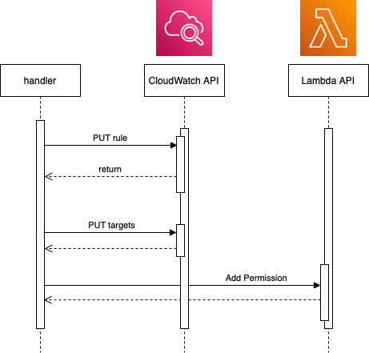

On a snowy day a while back I threw together a project to explore serverless functions. For whatever reason I decided the world needed a [Twitter garlic 'bot'](https://twitter.com/GarlicHub). It has a single purpose. It retweets things about garlic. It is glorious, simple, and to-date serves garlic content to 250+ individuals:


It has a problem though: *it isn't totally random*. The tweet selection is random enough - it uses the [search tweets](https://developer.twitter.com/en/docs/twitter-api/search-overview) API using the keyword `garlic` to pick an arbitrary tweet in the result set. The function to search & retweet runs once every 90 minutes. This is orchestrated via a [CloudWatch](https://docs.aws.amazon.com/AmazonCloudWatch/latest/events/WhatIsCloudWatchEvents.html) rule that triggers in a fixed rate of 90 minutes. Indeed, this is the part that bugs me: the trigger is deterministic (isn't random at all).

In a stroke of luck I stumbled on [this article](https://blog.bitsrc.io/aws-lambda-function-that-dynamically-schedules-its-next-runtime-e971fca6b6f6) demonstrating a lambda function that triggers itself. The solution centers around using a lambda function to create its own CloudWatch rule & attach itself as the target. When the rule is triggered, the lambda is triggered, and the process repeats. Using this premise I realized I could make Garlic bot truly tweet when it feels like it because each invocation schedules the next!

## Writing a lambda function that dynamically schedules

I initially set up a CloudWatch event rule to trigger every 90 minutes and invoke the lambda with retweet logic. To make the timing of Garlic Bot's tweets random, we can take this a step further and have the running lambda schedule the next invocation using three AWS API calls:

- [put-rule](https://docs.aws.amazon.com/cli/latest/reference/events/put-rule.html): Create the rule to run at a scheduled time. Importantly, the function creates a Cron expression and sends this in the schedule expression of the rule being created. The expression will signify a time of day like the one below at 06:17 AM.


- [put-targets](https://docs.aws.amazon.com/cli/latest/reference/events/put-targets.html): Add a target (the lambda we want to run) to the rule being created.
- [AddPermission](https://docs.aws.amazon.com/lambda/latest/dg/API_AddPermission.html): Authorize the CloudWatch rule to invoke the target lambda function.



Translating that to code is relatively simple with the SDKs available. Written in Node.js, the function `scheduleInvocation` does the above three tasks.


```javascript
const AWS = require("aws-sdk");
const RULE_NAME = 'GarlicTweet';
const LAMBDA_ARN = process.env.LAMBDA_ARN;

async function scheduleInvocation() {
    const nextInterval = between(100, 240);
    const currentTime = new Date().getTime(); // UTC Time
    const nextTime = addMins(currentTime, nextInterval);
    const nextMinutes = nextTime.getMinutes();
    const nextHours = nextTime.getHours();
    const scheduleExpression = "cron(" + nextMinutes + " " + nextHours + " * * ? *)";
    console.log('##### next schedule expression', scheduleExpression);

    // Create cloudwatch event
    const cloudEvent = new AWS.CloudWatchEvents();
    const createdEvent = await createEvent(cloudEvent, {
        Name: RULE_NAME,
        ScheduleExpression: scheduleExpression
    });

    console.log('##### created rule ', createdEvent);

    const targetResponse = await addTarget(cloudEvent);
    console.log('##### target response ', targetResponse);

    // Last tell AWS to trust invocations of lambda from cloudwatch
    const lambdaPermission = await addPerm(targetResponse.RuleArn);
    console.log('##### attached permissions ', lambdaPermission);
}

function between(min, max) {
    return Math.floor(
        Math.random() * (max - min + 1) + min
    )
}

const addMins = (date, mins) => {
    let res = new Date(date);
    res.setTime(res.getTime() + mins * 60000);
    return res;
}

async function createEvent(cloudEvent, params) {
    return new Promise((resolve, reject) => {
        cloudEvent.putRule(params, (err, data) => {
            if (err) {
                reject(err);
            }
            else {
                resolve(data);
            }
        });
    });
}

const addTarget = (cloudEvent) => {
    const params = {
        Rule: RULE_NAME,
        Targets: [
            {
                Arn: LAMBDA_ARN,
                Id: 'random-id-1234'
            }
        ]
    }

    return new Promise((resolve, reject) => {
        cloudEvent.putTargets(params, (err, data) => {
            if (err) reject(err)
            else resolve(data)
        });
    });
}

async function addPerm(source) {
    const params = {
        Action: "lambda:InvokeFunction",
        FunctionName: LAMBDA_ARN,
        Principal: "events.amazonaws.com",
        SourceArn: source,
        StatementId: "tweet-scheduled-event"
    };
    const lambda = new AWS.Lambda();
    return new Promise((resolve, reject) => {
        lambda.addPermission(params, function (err, data) {
            if (err) reject(err, err.stack);
            else resolve(data);
        });
    });
}

module.exports = {
    scheduleInvocation
};

```

Here for brevity I'm only showing the scheduling logic that runs within the lambda. Full [handler code can be found here](https://github.com/snimmagadda1/garlic-bot) but that's really it!

As mentioned, it adds an element of randomness to the schedule by using the `Math.Random()` function to get the number of minutes to add to the current time:

```javascript
function between(min, max) {
    return Math.floor(
        Math.random() * (max - min + 1) + min
    )
}
```

Since deploying this addition, Garlic Bot has been sporadically tweeting a diverse selection of flavorful content. Don't ask me when or what will be tweeted, because I truly don't know 😂.
