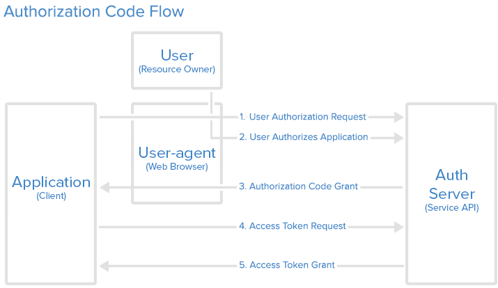

I recently started poking at the developer experience (DX) of the Node.js world. As a Java dev by day, I wanted to learn the JS community patterns on a lower level. I went through the exercise of standing up an Express.js + Passport.js server for a project, and surprisingly I didn't find a consensus pattern to functionally test routes secured with Oauth 2.0. Many docs were helpful, but dated. The approach here outlines a Passport.js strategy to test protected routes without making HTTP requests to the authentication provider.

## Prerequisites

- Node.js/Express application
- Passport.js + an Oauth 2.0 authentication strategy (here we use Github)
- Bun (used here for ease of running & testing)

## The problem

I wrote a little app with an option to sign-up using Github, and wanted to write functional tests. Testing protected routes using a [delegated sign-in](https://web.archive.org/web/20160322014955/http://hueniverse.com/2009/04/16/introducing-sign-in-with-twitter-oauth-style-connect/) generally requires making HTTP requests to the authentication provider. If you recall, the OAuth 2.0 authorization code flow[^1]:

 

If we have a route similar to this, how do we 'get past' the authentication in our functional tests to assert the business logic?:

```typescript
// Create a user
app.post(
  "/users",

  // Validate authentication state
  (req: any, res: any, next: any) => {
    if (!req.isAuthenticated()) {
      return res.status(401).json({ error: "Unauthorized" });
    }
    next();
  },

  // Business logic
  (req: any, res: any) => {
    const { name, email } = req.body;
    const user = { id: Date.now().toString(), name, email };
    userService.save(user);
    res.status(201).json(user);
  }
);
```

## Recapping the Oauth2 setup

I'll skip the majority of the Express setup & configuration & focus on setting up the testing approach. For reference, the full application and quick start can be found [here](https://github.com/snimmagadda1/express-passport-github-oauth2-functional-testing). The project delegates sign in via Github OAuth 2.0, specifically using session-based authentication with cookies. Notably, the app's strategy from `passport-github2` defined straight from the docs:

```typescript
import passport from "passport";
import { Strategy as GitHubStrategy } from "passport-github2";
import { userService } from "../services/userService"; // in-memory user store

passport.use(
  new GitHubStrategy(
    {
      clientID: process.env.GITHUB_CLIENT_ID!,
      clientSecret: process.env.GITHUB_CLIENT_SECRET!,
      callbackURL: "http://localhost:3000/auth/github/callback",
    },
    async (
      accessToken: string,
      refreshToken: string,
      profile: any,
      done: any
    ) => {
      try {
        // Find existing user or create a new one
        const user = userService.findOrCreate(profile);
        return done(null, user);
      } catch (error) {
        return done(error);
      }
    }
  )
);
```

and on successful authentication it performs a standard redirect to the homepage:

```typescript
app.get(
  "/auth/github/callback",
  passport.authenticate("github", { failureRedirect: "/login" }),
  (req, res) => res.redirect("/")
);
```

This is good and simple. But, if we try to test the business logic behind a protected route such as POST /users, out of the box, the test will have to actually authenticate with Github's Authorization server, using real credentials. This is extraneous for functional testing (and a potential security risk!). There has to be a better way.


[^1]: [DigitalOcean Intro to OAuth 2.0](https://www.digitalocean.com/community/tutorials/an-introduction-to-oauth-2)


<!-- ****** OUTLINE BELOW ***** -->

### Setting up Authentication

- Express configuration
- Passport.js GitHub strategy
- Session handling

### User Service

- Singleton pattern
- User model
- Storage implementation

## Testing Strategy

### Mocking OAuth2

- Creating authenticated test agent
- Session management
- Test fixtures

### Test Cases

- Unauthenticated access
- Protected endpoints
- User creation flow
- Session persistence

## Best Practices

- Type safety
- Error handling
- Test isolation
- Documentation

## Resources

- GitHub repository
- Related documentation
- Further reading
