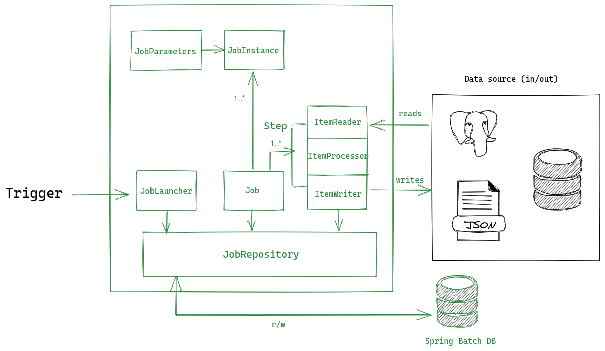

The last post took look at a Spring Batch project template to get off the ground quickly. In this one we're going to take it a step further and use the starter to build out a batch job. We won't focus too much here on the implementation of the framework itself ([docs do a good job of that](https://docs.spring.io/spring-batch/docs/4.3.x/reference/html/domain.html#domainLanguageOfBatch)), but rather to quickly enable yourself to build robust batch apps for enterprise apps.

## Prerequisites
You must have a general knowledge of Java for this guide. Along with that, knowledge of the following is very beneficial:
- Spring framework (IoC, beans, context, etc)
- Databases
- Docker (not required but useful for running locally)

## Goals
In this walkthrough, we will build a modest, multi-threaded batch pipeline. It will read a directory of files (XML data dumps from Stack Exchange), perform some processing, and write to a relational DB (MySQL). Here is the link to the full source:

- [**Source**](https://github.com/snimmagadda1/stack-exchange-dump-to-mysql)

## Intro to batch processing
If you're someone looking for a refresher in the strategies and principles of batch processing, I would recommend a read-through of Spring's batch introduction [here](https://docs.spring.io/spring-batch/docs/current/reference/html/spring-batch-intro.html#spring-batch-intro). I found this portion of their docs super helpful. It does a great job providing background on batch processing and translating that to Spring Batch's architecture.

## Understanding Spring Batch ... enough to get started
Like most-things-Spring, the framework comes with a lot built for you out of the box and you can get [running pretty quickly](https://spring.io/guides/gs/batch-processing/). Personal experience has taught me it's best to have a decent grasp on Spring's implementation of whatever you're using. We'll use the following diagram to quickly go through the way Spring implements batch.

The above isn't a comprehensive architecture diagram (theres some additional classes & interfaces exposed by the framework) but it should give you a baseline of what you're working with:
