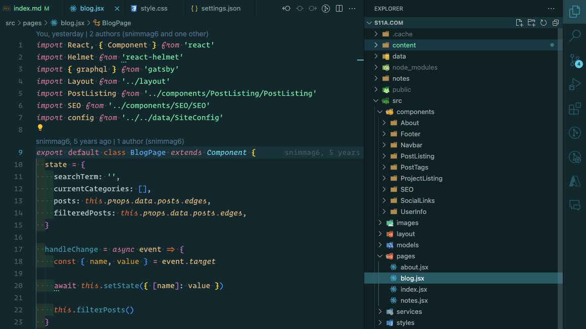
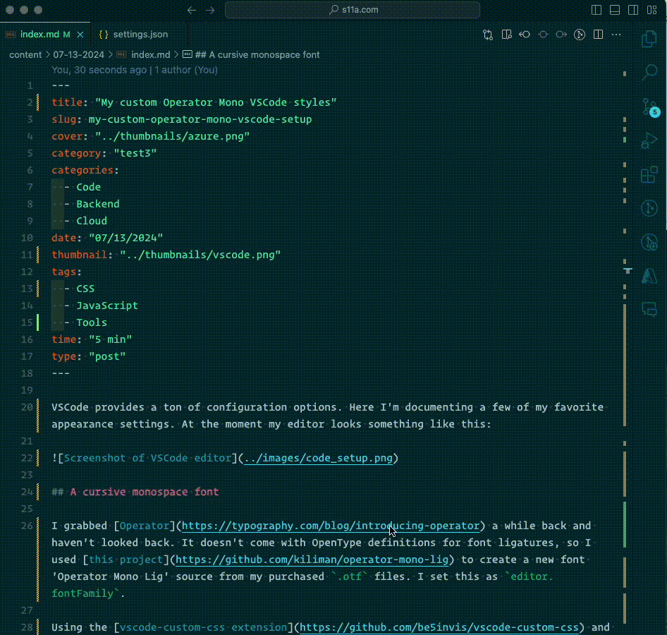

VSCode provides a ton of config options. Here I'm documenting some of my favorite appearance changes. At the moment my editor looks something like this:



## File browser on the right

Setting `"workbench.sideBar.location": "right"` avoids code jumps when toggling the sidebar.

## Line height

I use a lineHeight of 1.5 to reduce eye strain: `"editor.lineHeight": 1.5`.

## Render whites space

There are different configuration options for showing white space available. I prefer to have it all marked: `"editor.renderWhitespace": "all"`.

## A cursive monospace font

I grabbed [Operator](https://typography.com/blog/introducing-operator) a while back and haven't looked back. It doesn't come with OpenType definitions for font ligatures, so I used [this project](https://github.com/kiliman/operator-mono-lig) to create a new font 'Operator Mono Lig' source from my purchased `.otf` files. I set this as `editor.fontFamily`.

Using the [vscode-custom-css extension](https://github.com/be5invis/vscode-custom-css) and inspiration from [here](https://github.com/willfore/vscode_operator_mono_lig/tree/master?tab=readme-ov-file) I set the property `vscode_custom_css.imports` to a file containing rules for the editor. These rules allow for more cursive italics. The file `style.css` can be found below.

To add some language-specific font accents, I leveraged `VSCode's Inspect Editor Token and Scopes` option. I can insect tokens on a [per-language basis](https://github.com/microsoft/vscode/issues/66729) using this and modify their display. For example, since I write blog posts in markdown, I'd like the frontMatter emphasized (italicized):



## Relevant settings.json

```json
{
  "editor.fontFamily": "Operator Mono Lig, Fira Code",
  "editor.fontLigatures": true,
  "editor.fontSize": 16,
  "editor.formatOnPaste": true,
  "editor.inlineSuggest.enabled": true,
  "editor.lineHeight": 1.5,
  "editor.minimap.enabled": false,
  "editor.renderWhitespace": "all",
  "editor.tokenColorCustomizations": {
    "textMateRules": [
      {
        "scope": "meta.embedded.block.frontmatter",
        "settings": {
          "fontStyle": "italic"
        }
      },
    ]
  },
  "vscode_custom_css.imports": ["file:///Users/saiguy/.vscode/style.css"],
  "workbench.colorTheme": "Noctis Sereno",
  "workbench.iconTheme": "vscode-icons",
  "workbench.sideBar.location": "right",
}
```

Full VSCode settings can be found [here](https://github.com/funsaized/dotfiles/blob/main/settings.json).

## `style.css`

```css
.mtk7,
.mtk3,
.mtk4,
.mtk13,
.mtk16 {
  margin-left: 1px;
  font-family: "Operator Mono Lig";
}

.mtk1,
.mtk6,
.mtk7,
.mtk8,
.mtk9,
.mtk10,
.mtk12,
.mtk4 {
  font-family: "Operator Mono Lig";
}

/*
  For the tab titles.
*/
.monaco-icon-label-description-container .label-name {
  font-family: "Operator Mono Lig";
}

.tabs-container .monaco-icon-label-description-container .label-name,
.sidebar .monaco-icon-label-description-container .label-name,
.quick-open-row .monaco-icon-label-description-container .label-name {
  font-family: -apple-system, BlinkMacSystemFont, Segoe WPC, Segoe UI, HelveticaNeue-Light, Ubuntu, Droid Sans, sans-serif;
  font-size: 1em;
}

```
