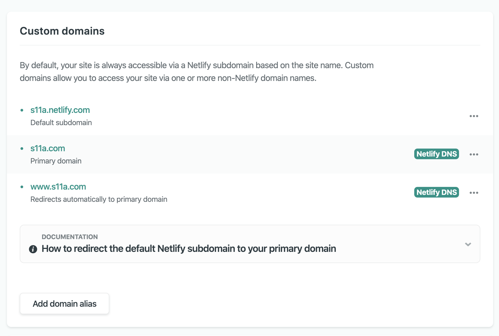

##### TL;DR: ~~Cloudfront~~ + ~~S3~~ + Route53 -> Netlify DNS

I like new things. AWS has an endless amount of cool things in its services, but site hosting in buckets just doesn't have that "shiny" new feel. My CI/CD process consisted of pushing local changes to github and running `npm run build && npm run deploy` in my terminal. I wanted more... and a robust pipeline would take a bit of groundwork to get up and running. This seemed a good enough excuse to try Netlify - **which offers a pipeline and much more pre-configured for free!**


## Getting on Netlify
I chose to follow the `New site from Git` track to quickly get a version of my site deployed. After signing up and a few clicks, Netlify was aware of my site and watching with a configured build pipeline. To get my Gatsby site to deploy, I only had to update the build command the pipeline would use. To do this, I added `netlify.toml` to the root of my directory containing the following:

```yaml
[build]
  publish = "public"
  command = "npm run build"
[build.environment]
  YARN_VERSION = "1.7.0"
  ```

Netlify then kicked off the build (since I had committed the file to master) and my site was live at http://s11a.netlify.com. CI/CD with no effort is the best kind!
  
Peeking at Netlify's settings, I saw it had some Git integrations enabled by default. I immediately enabled them all and created a PR to test. Deploy comment's and checks! Ooh ahh CI/CD:


Next I wanted to have Netlify host my site at my custom domain. After taking down my Cloudfront deployment and S3 buckets, it was time to transfer my DNS.

## Route53 -> Netlify DNS
I think parts of Netlify's docs are a perfect example of when minimal is too minimal, but their [migration docs](https://docs.netlify.com/domains-https/netlify-dns/) do a decent enough job explaining the process for a number of migration methods. In my case, I wanted to keep AWS as my registrar but use Netlify's DNS service. From reading  some of their suggested migration strategies, this seemed the easiest way to get started hosting. 

I started with [Netlify DNS](https://www.netlify.com/blog/2017/12/19/an-easier-way-to-manage-domains-and-dns-on-netlify/) (still in beta), so there was really only a few steps to get the site up at a custom domain:

1. Add the domain to Netlify
2. Update AWS Route53 hosted zone (NS, SOA)
3. Update the domain's name services (if controlled by AWS)

##### Adding the domain to Netlify

The Domains section of Netlify has a wizard for adding a domain. Using it is pretty straightforward. Notably, in step 2 I had to make sure to transfer all important DNS records from my hosted zone in Route53 to avoid downtime (i.e email, subdomains). 

##### Update the Route53 hosted zone (NS, SOA)

After the wizard was finished, I was presented with four of Netlify's nameservers. At this point it was time to transfer control of my domain's DNS to Netlify. In the Route53 console I performed the following steps to change my domain's DNS to Netlify DNS created in step 1:

* Replaced the existing NS value with the four Netlify hostnames
* Updated the SOA record: 
  * Changed the "authority-domain" value to the first DNS server Netlify listed: `dns1.p08.nsone.net.`
  * Changed the "hostmaster-email-address" value to `hostmaster@nsone.net.`
  * left the remaining values as is and clicked "Save Record Set"

Since AWS was my registrar, I had to update my domain's DNS. I navigated to `Route53` -> `Registered domains` -> `MY-DOMAIN.com` ->`Add or edit name servers` and set the value to the four Netlify name servers from step 1.

## Adding the custom domain to my site
After switching around the Route53 configuration, I had an externally registered domain associated with my Netlify account. The final step was to add this domain to my site. In the "Domain settings" panel I chose `s11a.com` as the primary domain and Netlify automatically configured `www.s11a.com` to redirect to it.



The final step was to enable HTTPS via Let's Encrypt on Netlify. In order to do this, I had to wait for DNS propagation and verification to finish on Netlify's end. I found this step to be a bit glitchy in Netlify's UI, as it would switch back and forth between a verified and unverified state. I waited a while and [flushed my DNS cache](https://developers.google.com/speed/public-dns/cache) and was finally able to provision a cert: 


And that's it, my site is now live and secured along with all of Netlify's features!


