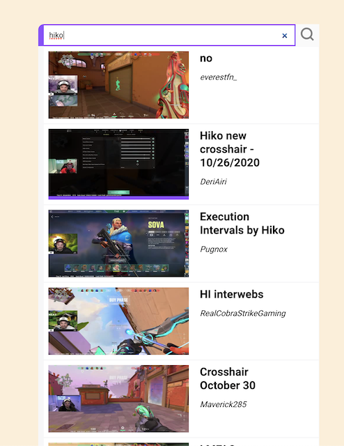

## Flexible and fast development

Admittedly I'm probably a bit late to the game on this one, but I stumbled on downshift and have been impressed! Developing with it feels _fast_. It offers so many features out of the box and uses render props. Render props are great because they decouple implementation details with the content being rendered, and after using this for a couple hours I am thrilled with the low-level control this puts in a developer's hands. Lets take this example, building a dropdown that searches a backend onChange:

```jsx
  render() {
    const items = this.state.items;
    return (
      <div className="container">
            <span>
              <InputStyles collapsed={items.length === 0}>
                <input
                  type="search"
                  name="search"
                  placeholder="Search for your fav streamer..."
                  onChange={(e) => {
                    e.persist();
                    this.onChange(e)
                  }}
                />
                <ButtonStyles disabled>
                  <svg
                    version="1.1"
                    viewBox="0 0 20 20"
                    x="0px"
                    y="0px"
                    className="svg"
                  >
                    <g>
                      <path
                        fillRule="evenodd"
                        d="M13.192 14.606a7 7 0
                        111.414-1.414l3.101 3.1-1.414
                        1.415-3.1-3.1zM14 9A5 5 0 114
                        9a5 5 0 0110 0z"
                        clipRule="evenodd"
                      ></path>
                    </g>
                  </svg>
                </ButtonStyles>
              </InputStyles>
                <DropDown>
                  {items.map((item, ind) => (
                    <DropDownItem
                      key={ind}
                      last={ind === items.length - 1}
                    >
                      {this.getVideoThumbnail(item)}
                      <div className="info">
                        <h4>{item.title}</h4>
                        <small>{item.creator_name}</small>
                      </div>
                    </DropDownItem>
                  ))}
                  {!items.length === 0 && !this.state.loading && (
                    <DropDownItem>
                      {" "}
                      No clips found ...
                    </DropDownItem>
                  )}
                </DropDown>
            </span>
      </div>
    );
  }
```



Full source code and styles can be [found here](https://github.com/funsaized/downshift-twitch-clips-search) - for brevity I've left out the full component declaration, data fetching and helper functions. In the JSX above all we've done so far is render a search `input` and map the results of a fetch to some styled `div`s. Pretty typical stuff. Now examine the result after we've used the `<Downshift>` component with some composition:


Some high-level things to note:

-   Downshift provides [a whole lot to destructure](https://github.com/downshift-js/downshift#advanced-props) in the form of `props` and `propGetters`. These props provide functionality and necessary aria attributes.

-   We provide an `onChange` function to tell the component what to do with changes. Since we are using a list of objects, we pass an `itemToString` prop to tell Downshift how to render our state.

-   Here we are taking advantage of `getInputProps` to hook up our `input` element and `getItemProps` to hook up our selections.

-   We are using the optional props `isOpen`, `inputValue` and `highlightedIndex` to enhance the user experience of our dropdown component

-   We have ommitted `getRootProps`. This is an important prop and recommended to provide a fully accessible experience with screen readers.

That's really all there is to it. Downshift is a primitive that fits into any component or existing implementation because of how flexibile the API is. Easy WAI-ARIA compliance win with alot of power.
