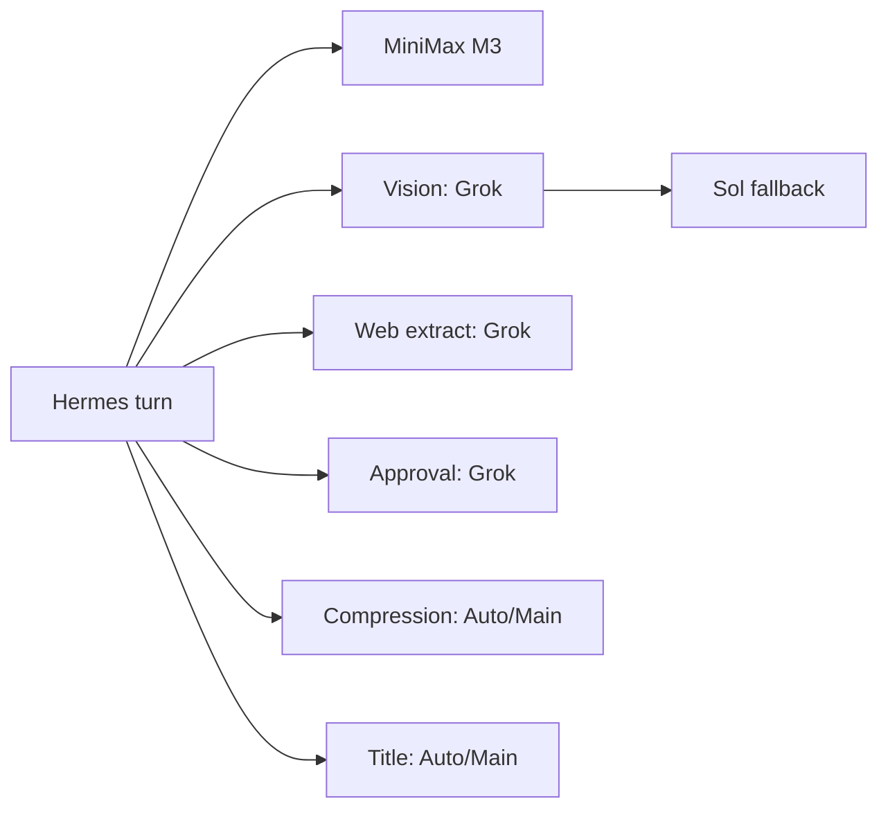

# Blog post outline: Why I stopped using my strongest model for everything

> Working outline for a first-person technical post about the Hermes setup on my
> Mac mini and the decisions behind it.
>
> Target article length: **1,900-2,400 words**. The post should explain the
> operating model, not reproduce every line of `config.yaml`.
>
> Snapshot: Hermes Agent v0.20.1, configuration schema v35. Re-verify model
> names, provider behavior, and configuration semantics immediately before
> publication.

## Working title options

1. **Why I Stopped Using My Strongest AI Model for Everything**
2. **How I Route AI Work Across MiniMax, GPT, and Grok on a Mac mini**
3. **My Hermes Setup: A Fast Default, Strong Fallbacks, and Local Execution**
4. **Building a Practical Multi-Model AI Operator on a Mac mini**
5. **The Reasoning Behind My MiniMax-First Hermes Setup**

Recommended title:

> **Why I Stopped Using My Strongest AI Model for Everything**

Possible subtitle:

> My Mac mini runs Hermes with MiniMax M3 for everyday orchestration, GPT-5.6
> Sol for difficult recovery work, and Grok for vision and web-heavy tasks.

## Audience and promise

**Audience:** Developers running AI agents on an always-on workstation, home
server, or Mac mini who want useful automation without sending every task to
the slowest or most capable model they can access.

**Reader promise:** By the end, the reader should understand:

- why model selection should follow task shape instead of a single quality
  ranking;
- the difference between failure fallback and deliberate quality escalation;
- how auxiliary models keep vision, extraction, approvals, and compression off
  the main reasoning path;
- why context limits are an operating decision even when models advertise huge
  windows;
- how bounded delegation and Git worktrees reduce parallel-agent collisions;
- why local execution, checkpoints, approvals, and verification matter as much
  as model choice;
- which tradeoffs remain in the final setup.

## Thesis

The best default model is not automatically the strongest model available. My
Hermes setup works better when a fast model handles routine orchestration, a
strong reasoning model is one explicit switch away, and specialist work is
routed to a provider that fits it. The surrounding controls make that routing
usable: bounded context, fail-closed compression, leaf-only delegation,
worktree isolation, smart approvals, local execution, and real smoke tests.

## Editorial constraints

- Write in first person and treat the setup as a current working system, not a
  universal prescription.
- Do not frame the post as a synthetic model benchmark. The evidence is
  operational behavior in my own workflow.
- Separate verified behavior from judgment. For example, the fallback order is
  a fact; calling Sol the stronger recovery lane is my operating judgment.
- Do not claim automatic escalation for hard tasks. Hermes fallbacks activate
  on provider or API failures, not because an answer is mediocre.
- Avoid exact Discord channel IDs, OAuth tokens, private paths, account data,
  session IDs, internal hostnames, or credential expiry timestamps.
- Use sanitized configuration excerpts with blank placeholders where a reader
  would otherwise copy a personal deployment identifier.
- Keep the article centered on decisions and tradeoffs. Move exhaustive config
  reference material to a gist or appendix if needed.
- Avoid generic AI-agent hype. Show what the setup does and where it can still
  fail.

---

# Article outline

## 1. Hook: the strongest model was the wrong default - 150 words

### Point

I originally ran GPT-5.6 Sol as the default for nearly everything. It was a good
quality baseline, but most Hermes turns are not architecture reviews. They are
small operational decisions: inspect a repository, run a command, summarize a
page, dispatch a child task, or report what changed.

Using the heavyweight reasoning path for all of that made the system feel more
ceremonious than useful. I wanted Hermes to act like an operator on my Mac mini:
fast for ordinary work, capable of reaching for more depth when the task earns
it, and resilient when one provider is unavailable.

### Sample opening

> Most of what my AI agent does is not difficult. It checks files, runs builds,
> searches documentation, delegates focused work, and tells me what actually
> happened. I had GPT-5.6 Sol handling all of it. The answers were good, but the
> default was optimized for the hardest five percent of the workload. I rebuilt
> the setup around a different idea: use a fast model for the normal path, keep
> the strongest reasoning model close, and route specialist work on purpose.

### Suggested visual

```text
Every task → strongest model

became

routine work → fast default
hard work    → deliberate model switch
failure      → strong fallback chain
vision/web   → specialist lane
```

---

## 2. What I was optimizing for - 170 words

### Requirements

- Keep the Mac mini as the always-on Hermes host.
- Keep ordinary terminal commands local instead of making the whole environment
  depend on a remote compute node.
- Make routine Discord and CLI turns responsive.
- Preserve access to high-reasoning work without paying the latency on every
  turn.
- Survive provider outages across three independent OAuth providers.
- Bound context growth and cold prompt rereads.
- Run a few independent child agents without recursive agent explosions.
- Isolate parallel Git edits when possible.
- Fail closed around destructive commands, unattended cron jobs, and failed
  compression summaries.
- Keep Mnemosyne memory, cron, plugins, and existing tool integrations intact.

### Non-goals

- Automatically choosing the objectively best model for every prompt.
- Building a benchmark router.
- Recursive swarms of agents.
- Moving all execution to the gaming PC.
- Treating a large advertised context window as permission to resend unlimited
  history forever.

### Line worth keeping

> I was optimizing for a system I would leave running, not a leaderboard winner
> I would demo once.

---

## 3. The model topology - 240 words

### Main route

```text
MiniMax M3 / MiniMax OAuth / low reasoning
                    │
                    │ provider or API failure
                    ▼
GPT-5.6 Sol / OpenAI Codex / high reasoning
                    │
                    │ failure
                    ▼
Grok 4.6 / xAI OAuth / low reasoning
```

### Why MiniMax M3 is the default

- It is fast enough for the high-frequency orchestration path.
- Its large context window gives Hermes room before the local operating cap.
- It can use tools and dispatch focused child work.
- Low reasoning is appropriate for ordinary inspection and coordination.

Avoid making unsupported universal quality or price claims. Describe this as a
fit for the observed workload.

### Why Sol is the first fallback

If the default provider fails, the next attempt should maximize the chance of
finishing correctly. Sol runs at high reasoning and is also the manual choice
for architecture, difficult debugging, release decisions, and consequential
reviews.

### Why Grok is still in the chain

Grok adds a third independent provider and already handles specialist visual and
web-oriented work. It is useful resilience even though it is not the first
recovery lane.

### Critical clarification

Fallback is not quality routing:

```text
M3 returns a weak but valid answer → no fallback
M3 gets a rate limit or provider failure → Sol activates
```

For hard work, I select Sol explicitly or pin the model on the delegated or
scheduled task.

---

## 4. Reasoning is a per-model control - 130 words

### Configuration idea

```yaml
agent:
  reasoning_effort: low
  reasoning_overrides:
    "MiniMax-M3": low
    "grok-4.6": low
    "gpt-5.6-sol": high
```

### Explanation

The global low setting keeps unknown or newly selected models from silently
becoming expensive reasoning paths. Explicit overrides document the three known
roles.

MiniMax and Grok handle fast operational work. Sol gets the larger reasoning
budget because it is the recovery and deliberate deep-work model.

Mention one setup bug that verification caught: Grok 4.6 accepts low, medium,
and high reasoning, but rejects `none`. A plausible-looking configuration was
not enough; the provider contract mattered.

---

## 5. Auxiliary models keep side work off the main lane - 230 words

### Routing map

```text
Vision           → Grok 4.6 low → Sol fallback
Web extraction   → Grok 4.6 low
Smart approvals  → Grok 4.6 low
Compression      → auto/main → configured fallback policy
Session titles   → auto/main
```

### Vision and web extraction

Vision and extraction have different task shapes from repository orchestration.
Grok handles screenshots, image analysis, and web-heavy inputs without making it
the default for every conversation.

### Smart approvals

Hermes runs deterministic destructive-command checks before asking the
auxiliary model to classify uncertain commands. The classifier is not the only
safety boundary.

### Compression and titles use `auto`

The important implementation detail is OAuth runtime reuse. Explicitly pinning
title generation to `minimax-oauth` looked correct but failed a live call because
that auxiliary path searched for an API key instead of inheriting the active
OAuth client. Switching the task to `auto` reused the authenticated main runtime
and passed.

This is a useful lesson for the article:

> Provider names in YAML are not proof that the runtime path is authenticated.
> Exercise the auxiliary call.

### Optional visual



---

## 6. I cap context long before the advertised maximum - 230 words

### Configuration

```yaml
compression:
  enabled: true
  threshold: 0.35
  threshold_tokens: 180000
  target_ratio: 0.20
  protect_last_n: 24
  protect_first_n: 3
  abort_on_summary_failure: true
```

### Why 180K

A million-token context window is technically useful, but repeatedly sending a
huge live history has operating costs:

- higher latency;
- larger cold rereads when fallback changes providers;
- more stale tool output competing with the current task;
- slower recovery from long-running Discord threads.

The absolute cap creates one predictable operating boundary across the model
routes. The effective trigger is about 180K for M3, Sol, and Grok after Hermes'
model-specific floors and caps are applied.

### What survives compression

- the system prompt;
- the first three non-system messages;
- a summary of the compressed middle;
- at least the recent protected tail when feasible;
- durable archived history for later search.

The post-compression target is roughly 36K tokens before message-protection
constraints.

### Why summary failure aborts

If the summary model fails, Hermes preserves the live context instead of
replacing the middle with a static unavailable marker. I would rather pause and
fix compression than silently lose the reasoning trail.

---

## 7. Delegation is parallel, bounded, and leaf-only - 190 words

### Configuration

```yaml
delegation:
  provider: minimax-oauth
  model: MiniMax-M3
  reasoning_effort: low
  max_concurrent_children: 3
  max_spawn_depth: 1
  orchestrator_enabled: false
  worktree_isolation: true
```

### Why three children

Three is enough to split independent research, implementation, review, or
source-inspection work without turning the Mac mini into a process farm.

### Why no recursive orchestration

`max_spawn_depth: 1` means first-generation children are leaves. Setting
`orchestrator_enabled: true` beside that limit would be misleading because the
child cannot fan out. The final configuration says what it does.

Durable pipelines belong in cron or a work queue rather than a process-local
subagent tree.

### Why worktrees

Local Git worktree isolation gives each child a separate checkout and reduces
parallel edit collisions. It is not a hard guarantee: Hermes can degrade to a
shared workspace if worktree creation fails, so consequential workflows still
need diff review and verification.

### Evidence note

A real leaf child returned its requested result in about 1.5 seconds. Present
that as a smoke test, not a performance benchmark.

---

## 8. The models are only half the system - 240 words

### Local terminal execution

```yaml
terminal:
  backend: local
  cwd: <PROJECT_ROOT>
  timeout: 600
```

The Mac mini remains the ordinary execution host. Remote compute nodes are
explicit targets for workloads that need them, not invisible dependencies for
every shell command.

### Tool-output limits

```yaml
tool_output:
  max_bytes: 80000
  max_lines: 2500
  max_line_length: 2000
```

Larger output helps with code and log inspection, but it also reaches the 180K
compression boundary faster. Pagination remains part of the workflow.

### Checkpoints

Filesystem checkpoints are enabled with 20 snapshots per workspace, automatic
pruning, size limits, and short retention. They complement Git and provide a
quick rollback path for file edits.

### Approvals

```yaml
approvals:
  mode: smart
  timeout: 300
  cron_mode: deny
```

Interactive uncertainty can ask for a decision. Unattended cron jobs fail closed
instead of waiting forever or auto-approving dangerous commands.

### File descriptors

The gateway LaunchAgent uses an 8,192 file-descriptor soft limit. Long-lived
Discord connections, HTTP clients, child processes, pipes, cron work, and
browser sessions all consume descriptors. This is boring configuration until a
busy agent hits the default service limit.

---

## 9. Applying the config safely exposed the real bugs - 210 words

### Setup sequence

1. Back up the existing config.
2. Migrate the Hermes schema before applying new keys.
3. Change only the intended sections so memory, plugins, channels, and toolsets
   remain intact.
4. Verify the resolved config, not only the YAML text.
5. Restart or refresh the long-lived gateway service.
6. Run real model, title, delegation, cron, and service checks.

### Bugs caught during application

- `api_max_retries: 1` means one total Hermes attempt, not an initial attempt
  plus one retry. The intended value was `2`.
- Grok 4.6 rejected `reasoning_effort: none`; `low` is the minimum supported
  setting for this route.
- Structured maps and lists passed through scalar `config set` commands became
  strings until repaired with Hermes' atomic configuration writer.
- Model names containing dots could not safely be built as ordinary dotted CLI
  paths.
- Explicit MiniMax OAuth title routing failed; `auto` correctly inherited the
  active OAuth runtime.
- A scheduled acceptance soak had an old model snapshot. The global model switch
  would have triggered Hermes' drift guard, so the job was explicitly pinned to
  its original Sol runtime.

### Point

The configuration was not done when the file parsed. It was done when the real
runtime paths passed and existing automation still had an intentional model.

---

## 10. How I use the finished setup - 170 words

### Daily routing table

```text
Routine inspection and orchestration → MiniMax M3 low
Parallel focused research           → up to 3 M3 leaf agents
Routine repository work             → M3 with isolated worktrees
Architecture and hard debugging     → manually select Sol high
Release or acceptance decisions     → pin Sol high
Screenshots and image analysis      → Grok 4.6
Web-heavy extraction                → Grok 4.6
Provider outage                     → Sol, then Grok
Durable scheduled work              → cron with explicit model when needed
GPU or Windows-specific work        → explicitly target the remote machine
```

### Concrete examples

- Morning research can fan out three focused M3 children while Grok handles
  X-oriented or web-heavy inputs.
- A repository cleanup can use isolated worktrees for implementation and review.
- An acceptance soak stays pinned to Sol even when the global default changes.
- A long Discord thread compresses at a known boundary instead of growing until
  the provider refuses it.
- A difficult architecture problem gets an explicit `/model` switch rather than
  hoping fallback will interpret difficulty.

---

## 11. Tradeoffs and limits - 160 words

### What improved

- Routine turns feel faster and less ceremonious.
- Provider diversity is explicit.
- High reasoning remains available without becoming the tax on every task.
- Context and parallelism have known boundaries.
- Git edits, unattended commands, and failed summaries have recovery behavior.
- The Mac mini stays the understandable center of execution.

### What this does not solve

- M3 can return a weak answer without triggering fallback.
- Provider failover loses prompt-cache locality and requires a cold reread.
- Worktree isolation can degrade rather than fail closed.
- An 80K tool result can consume a noticeable part of the context runway.
- Three OAuth providers mean three authentication lifecycles to maintain.
- The Mac mini remains one machine and one operational failure domain.
- Model behavior and supported reasoning values can change between releases.

### Suggested line

> The setup is intentionally opinionated, but it is not automatic intelligence.
> I still decide when a task deserves the expensive reasoning path.

---

## 12. Sanitized configuration excerpt - 120 words plus code

Include one compact configuration sample with only the sections needed to
explain the topology. Use placeholders for any deployment-specific values.

```yaml
model:
  provider: minimax-oauth
  default: MiniMax-M3

fallback_providers:
  - provider: openai-codex
    model: gpt-5.6-sol
  - provider: xai-oauth
    model: grok-4.6

agent:
  reasoning_effort: low
  reasoning_overrides:
    "MiniMax-M3": low
    "grok-4.6": low
    "gpt-5.6-sol": high
  api_max_retries: 2

terminal:
  backend: local
  cwd: <PROJECT_ROOT>

compression:
  enabled: true
  threshold: 0.35
  threshold_tokens: 180000
  target_ratio: 0.20
  protect_last_n: 24
  protect_first_n: 3
  abort_on_summary_failure: true
```

Link to a sanitized full example only if one is created and reviewed separately.
Do not paste the live `config.yaml` into the post.

---

## 13. Closing - 110 words

### Sample conclusion

> My Mac mini now runs Hermes with a fast normal path instead of treating every
> request like a difficult reasoning benchmark. MiniMax M3 handles the repetitive
> operational work. Sol is the recovery lane and the model I choose when the
> decision matters. Grok handles the visual and web-heavy edges. The rest of the
> configuration keeps that routing honest: context compresses at a known limit,
> child agents cannot recursively multiply, Git work is isolated when possible,
> unattended commands fail closed, and the gateway is tested as a service rather
> than assumed to work because the YAML parsed. The models matter, but the useful
> part is the operating system around them.

### Final compact diagram

```text
fast default
     ↓
bounded tools and context
     ↓
local execution on the Mac mini
     ↓
explicit deep-work switch or provider fallback
     ↓
verified result
```

---

# Publication checklist

## Facts to re-verify

- [ ] Current Hermes version and config schema.
- [ ] MiniMax M3, GPT-5.6 Sol, and Grok 4.6 model identifiers.
- [ ] Supported reasoning values for each provider route.
- [ ] `api_max_retries` still counts total Hermes attempts.
- [ ] Fallback remains failure-based and turn-scoped.
- [ ] Current model context metadata and the effective compression triggers.
- [ ] `provider: auto` still inherits the authenticated main runtime for titles
      and compression.
- [ ] Delegation depth semantics remain unchanged.
- [ ] Worktree isolation cleanup and degradation behavior remain unchanged.
- [ ] Checkpoint retention and file-size limits match the live resolved config.
- [ ] Gateway LaunchAgent still carries the intended file-descriptor limit.
- [ ] All three OAuth providers are authenticated before collecting screenshots.

## Evidence to collect

- [ ] Sanitized `hermes fallback list` output.
- [ ] Sanitized resolved reasoning table.
- [ ] One main-model smoke result with duration.
- [ ] One completed leaf-child transcript.
- [ ] Gateway and cron health output without IDs or private destinations.
- [ ] LaunchAgent resource-limit output without private paths.
- [ ] Compression trigger calculation checked against the current source/docs.
- [ ] Hermes Doctor summary with unrelated account and workspace details removed.

## Material to remove or sanitize

- [ ] OAuth tokens and credential metadata.
- [ ] Discord channel IDs and allowed-user IDs.
- [ ] Local usernames and absolute home paths.
- [ ] Session IDs, delegation IDs, and cron job IDs.
- [ ] Private hostnames and Tailscale addresses.
- [ ] Plugin secrets and provider environment variables.
- [ ] Raw logs that contain prompts, tool output, or repository paths.
- [ ] The complete live configuration file.

## Suggested visuals

1. Main/fallback/auxiliary routing diagram.
2. A small table mapping task type to model.
3. Context growth and 180K compression boundary diagram.
4. Parent with three leaf children and isolated Git worktrees.
5. Sanitized terminal output showing model, gateway, and delegation checks.
6. Mac mini photo or desk shot as the human anchor for the post.

## Suggested official references

- Hermes Agent configuration documentation
- Hermes provider and OAuth documentation
- Hermes fallback-provider documentation
- Hermes delegation documentation
- Hermes context-compression documentation or source reference
- Hermes checkpoint and approval documentation
- MiniMax M3 model documentation
- OpenAI Codex model documentation
- xAI Grok model documentation

## Material for an appendix or separate gist

- Full sanitized Hermes configuration.
- Exact `hermes config set` commands.
- Detailed provider authentication setup.
- Full resolved-config assertion script.
- LaunchAgent plist details.
- Complete cron routing table.
- Troubleshooting notes for OAuth auxiliary-model inheritance.
