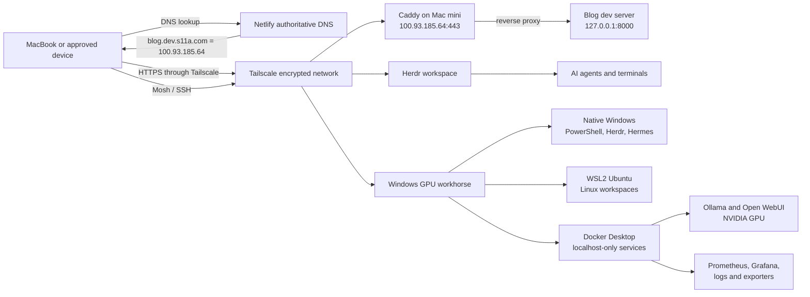
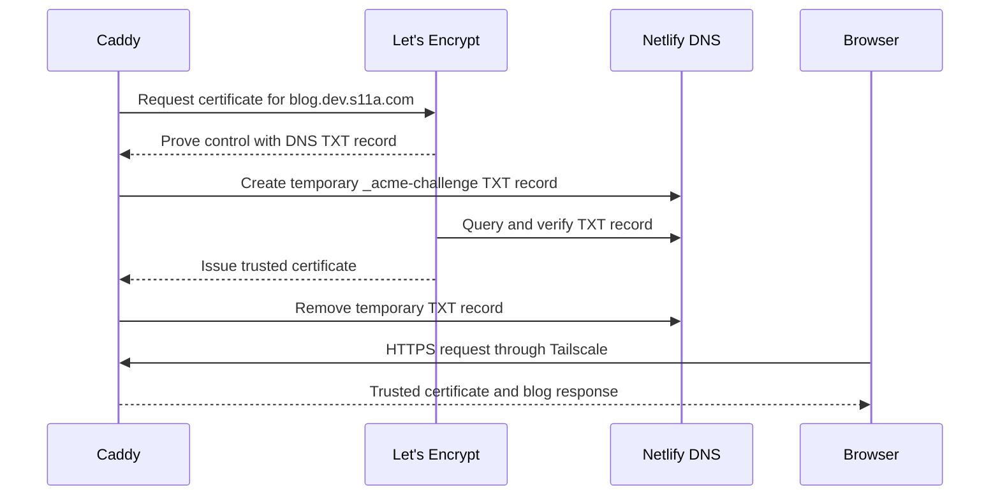

# Blog Post Outline: A Private Local Cloud for Remote Development

> Working outline for a concise, roughly 12-minute read.
>
> Target article length: **2,100-2,500 words**. Planned budget: **about 2,430 words**.
>
> Public source of truth: [How I Turned a Mac mini Into a Private Development Cloud](https://gist.github.com/funsaized/43d6f7bf40d52113616880ed85663560)
>
> A private operational document is retained outside this repository for fact-checking. Never link to or publish it from the finished article.

# Implementation hardening gate

> Author-only working section. Remove it from the finished article, but do not
> remove it from the outline until the required work is implemented and the
> evidence exists. The article should read like an engineering record, not a
> stack tour. Do not describe the system as hardened, least-privilege,
> recoverable, or unattended until the corresponding gate below passes.

## Publication bar

- **P0 is mandatory before publication.** Every item needs implementation
  evidence and a negative test, not just a configuration screenshot.
- **P1 is mandatory before calling the system operationally mature.** If an item
  remains open, name the limitation plainly in the article.
- **P2 is defense-in-depth.** These items can remain future work if the threat
  model and current boundary make the tradeoff explicit.
- Preserve the distinction between **implemented**, **verified**, **planned**,
  and **accepted risk**. Never convert a TODO into past tense because the prose
  sounds better that way.

## P0: close before publishing

### 1. Write and enforce the access matrix

- [ ] Define the trust zones: approved client, Mac mini, native Windows, WSL
  Ubuntu, container network, physical LAN, tailnet, and public internet.
- [ ] Write the exact allowed flows by source identity, destination identity,
  protocol, and port. Everything not listed is denied.
- [ ] Put the Tailscale grants or ACL policy under private version control and
  validate it before deployment.
- [ ] Test every intended flow from an approved device and test the same port
  from a non-approved tailnet identity or temporary test tag.

**Done evidence:** a sanitized access matrix, policy-validation output, positive
connection results, and denied negative probes for SSH, Mosh, HTTPS, and any
AI-service ingress.

### 2. Make remote login key-only and least-privilege

- [ ] Use separate, passphrase-protected Ed25519 keys per client device. Do not
  reuse one private key across the laptop and phones.
- [ ] Disable password and keyboard-interactive SSH after proving key access on
  the Mac mini, native Windows, and WSL Ubuntu.
- [ ] Restrict SSH to explicit users and Tailscale source ranges or interfaces.
- [ ] Replace routine Windows remote work under an Administrator account with a
  dedicated non-admin account. Elevate only for explicit maintenance.
- [ ] Review whether the macOS remote-editing account needs Full Disk Access to
  all of `Documents`; narrow it to a dedicated project root if possible.
- [ ] Document key enrollment, revocation, lost-device response, and a local
  console recovery path before disabling fallback authentication.

**Done evidence:** key login succeeds, password login fails, an unauthorized
user fails, LAN-side SSH fails, a revoked test key fails, and administrative
actions still require explicit elevation.

### 3. Enforce host firewalls, not just application binding

- [ ] Enable the macOS application firewall. Use `pf` for source-range and
  interface restrictions that the application firewall cannot express.
- [ ] Replace broad Windows inbound posture with explicit rules for the
  Tailscale interface and intended SSH sources.
- [ ] Enable and verify Ubuntu `nftables` or UFW rules for WSL SSH and the
  selected Mosh UDP range on `tailscale0` only. Mirrored networking makes
  negative testing mandatory; do not assume the interface rule works.
- [ ] Keep application and container listeners on loopback unless a reviewed
  ingress design requires otherwise.

**Done evidence:** listener inventory plus LAN, tailnet, and localhost probes
after a cold reboot. Required paths work; every unintended interface refuses or
times out.

### 4. Harden tailnet identity and policy

- [ ] Require MFA on the identity provider and enable device approval.
- [ ] Replace the implicit all-device/all-port posture with explicit grants for
  the Mac mini, native Windows, WSL Ubuntu, and client devices.
- [ ] Decide which unattended nodes may have key expiry disabled, document the
  exception, and keep expiry enabled everywhere else.
- [ ] Verify device-removal and credential-revocation procedures with a test
  node.

**Done evidence:** exported sanitized policy, approved-device inventory,
documented expiry exceptions, and proof that a removed test node loses access.

### 5. Choose one supported access path for AI services

- [ ] Keep raw Ollama, Grafana, Prometheus, Dozzle, and exporter ports on
  `127.0.0.1`.
- [ ] Either document SSH tunneling as the supported path or build an
  authenticated HTTPS ingress bound only to Tailscale. Do not support both by
  accident.
- [ ] If Open WebUI is exposed, enable its authentication before changing the
  bind address.
- [ ] Remove anonymous Grafana administration and require a real administrator
  identity before any remote exposure.
- [ ] Put Ollama behind an authenticated proxy with explicit origins. Never
  expose the raw unauthenticated API directly to the LAN or tailnet.
- [ ] Apply Tailscale policy to the user-facing ingress, not only to SSH.

**Done evidence:** one documented URL or tunnel command works from an approved
client; direct raw-service connections, unauthorized tailnet access, and LAN
access all fail.

### 6. Encrypt and prove recovery from backup

- [ ] Verify FileVault on the Mac mini and BitLocker or Windows Device
  Encryption on the gaming PC. Escrow recovery keys outside the encrypted
  devices.
- [ ] Create encrypted, versioned, off-host backups for Caddy configuration and
  state, the tailnet policy, Compose files, Open WebUI data, Grafana dashboards,
  critical container volumes, SSH configuration, and the WSL distro export.
- [ ] Classify Ollama models and Prometheus history as backed up or reproducible.
  Do not waste backup capacity without making the choice explicit.
- [ ] Define recovery point and recovery time targets for the Mac mini and GPU
  workhorse.
- [ ] Restore onto a temporary location or clean test environment and exercise
  the recovered configuration.

**Done evidence:** backup inventory, encrypted off-host copy, freshness check,
restore transcript, restored checksums, and a measured recovery time.

### 7. Prove unattended lifecycle and cold-start recovery

- [ ] Verify Tailscale, Caddy, SSH, Herdr, WSL systemd services, Docker Desktop,
  and the Compose stack recover after host reboot and network loss.
- [ ] Determine whether Docker Desktop requires interactive Windows login. If
  it does, either automate a safe supported startup path or classify the GPU
  workhorse as on-demand rather than always-on infrastructure.
- [ ] Set explicit Windows sleep, restart, and update behavior so the gaming PC
  does not silently disappear during expected compute windows.
- [ ] Verify the system after a real cold boot, not only a process restart.

**Done evidence:** timestamped boot-to-ready timeline, no manual repair steps,
all expected health checks passing, and the first successful GPU inference.

### 8. Make DNS and remote commands deterministic

- [ ] Replace the pinned public-only WSL resolver with a tested
  `systemd-resolved` split-DNS route for the tailnet suffix.
- [ ] Define SSH client aliases with explicit users, ports, identity files,
  keepalives, and host-key checking for the mini, Windows, and WSL targets.
- [ ] Standardize the supported Herdr and Mosh commands so reconnecting does not
  require remembering topology quirks.
- [ ] Verify forward and reverse MagicDNS behavior after WSL and Windows reboot.
- [ ] Add a consistency check that compares the mini's current Tailscale address,
  the public DNS answer, and every Caddy `bind` value. Alert on any mismatch.

**Done evidence:** a sanitized SSH configuration, repeatable one-command access
to all three environments, DNS tests from Windows, WSL, and macOS, and a forced
mismatch that causes the consistency check to fail.

### 9. Put the system configuration under reproducible control

- [ ] Store sanitized templates and private deployment configuration in the
  appropriate repositories. Keep secrets external.
- [ ] Pin every container image by version and digest, not only Ollama.
- [ ] Make the custom Caddy build reproducible from a checked-in manifest and
  verify the installed binary checksum and required modules.
- [ ] Add deterministic validation for Compose rendering, Caddy configuration,
  tailnet policy, firewall rules, and required environment variables.
- [ ] Document rollback for Caddy, container images, Tailscale policy, firewall
  policy, and WSL configuration.

**Done evidence:** a clean-machine or isolated-environment rebuild reaches the
same listener map and passes the acceptance suite without copying undocumented
state.

### 10. Build one end-to-end acceptance command

- [ ] Automate DNS, certificate, HTTPS body, listener, SSH, Mosh, Herdr,
  container-health, GPU-inference, firewall, and negative-access checks.
- [ ] Run it from an approved client and include tests from the LAN and an
  unauthorized tailnet identity.
- [ ] Redact hostnames, addresses, usernames, tokens, and model prompts from the
  publication artifact.
- [ ] Run the final suite after every hardening change and once more after a
  cold reboot.

**Done evidence:** a versioned script exits nonzero on any failed boundary, plus
a sanitized final report showing all positive and negative gates passing.

### 11. Reconcile the documents with the verified state

- [ ] Add a dated snapshot and explicit status language for each material
  security and reliability claim: live, verified, planned, or accepted risk.
- [ ] Update the private document with the deployed configuration and sanitized
  evidence references immediately after each hardening change.
- [ ] Update the public document only from verified facts. Do not copy private
  hostnames, addresses, paths, account names, or active weakness details.
- [ ] Run an independent final review against the exact post-hardening
  configuration and resolve every blocking finding before drafting the article.

**Done evidence:** public and private claims agree on architecture and status,
the public privacy scan is clean, and an independent reviewer returns a
publication-ready verdict with no blocking findings.

## P1: operational maturity

### Monitoring, alerts, and capacity

- [ ] Add alerting for host/container downtime, repeated restarts, backup age,
  certificate expiry, disk pressure, WSL virtual-disk growth, GPU temperature,
  VRAM saturation, and failed black-box probes.
- [ ] Send alerts through a channel that still works when the monitored host is
  down. A dashboard alone is not alerting.
- [ ] Set explicit Prometheus retention, Docker log rotation, and model-pruning
  policies.
- [ ] Define warning and critical thresholds, including a minimum free-space
  floor before model pulls.
- [ ] Publish a usable operator dashboard with, at minimum, service health,
  request latency, GPU utilization and temperature, VRAM, WSL memory, disk free
  space, container restart count, certificate lifetime, and backup age.

### Patch, supply-chain, and rollback discipline

- [ ] Define a maintenance cadence for macOS, Windows, Ubuntu, WSL, Tailscale,
  Docker Desktop, NVIDIA drivers, Caddy, Herdr, Hermes, and container images.
- [ ] Scan container images and the custom Caddy artifact for known
  vulnerabilities before promotion.
- [ ] Record checksums or an SBOM for custom and pinned artifacts.
- [ ] Use a staged update procedure with a real rollback test, not automatic
  latest-version deployment.

### Secrets and service privilege

- [ ] Use the narrowest DNS credential the provider supports and document the
  blast radius if only an account-wide token is available.
- [ ] Define secret rotation and emergency revocation procedures.
- [ ] Evaluate running Caddy under a dedicated service identity instead of root.
  If root remains necessary, document the accepted risk and harden ownership,
  mutability, and the LaunchDaemon boundary.
- [ ] Run containers as non-root where supported and drop unnecessary Linux
  capabilities.

### Failure model and service objectives

- [ ] State plainly that the mini, gaming PC, and single NVMe are individual
  failure domains. This is robust personal infrastructure, not high
  availability.
- [ ] Define availability expectations, recovery targets, and which services
  are allowed to be on-demand.
- [ ] Write short runbooks for expired certificates, lost tailnet access,
  corrupt WSL disks, failed GPU passthrough, full storage, and bad upgrades.

### Operator onboarding and change runbooks

- [ ] Write a zero-to-ready runbook for admitting a new trusted device without
  reusing keys or widening policy.
- [ ] Write runbooks for exposing a new application, rotating SSH and DNS
  credentials, rebuilding and rolling back Caddy, updating container images,
  and restoring WSL and critical volumes.
- [ ] Give each runbook prerequisites, exact validation commands, rollback, and
  a clear completion signal.
- [ ] Dry-run the runbooks from a clean client or temporary environment and fix
  every step that depends on undocumented operator memory.

## P2: defense-in-depth and future scaling

- [ ] Enable Tailnet Lock after validating the signing-key recovery procedure.
- [ ] Consider hardware-backed SSH keys or an SSH certificate authority if the
  device count grows.
- [ ] Add a UPS and tested graceful shutdown for the always-on mini and network
  gear.
- [ ] Add a second SSD or move model and telemetry data off the Windows system
  disk before capacity becomes operational risk.
- [ ] Segment untrusted home/IoT devices from development hosts at the LAN or
  VLAN layer.
- [ ] Revisit Docker Desktop as the service host if interactive startup,
  upgrades, or desktop coupling prevent the documented recovery target. Native
  Linux is the fallback, not a premature requirement.

## Evidence bundle required before writing the final article

- [ ] Sanitized architecture and trust-boundary diagram.
- [ ] Sanitized access matrix and deployed tailnet policy.
- [ ] Listener inventories from macOS, Windows, WSL, and Docker.
- [ ] Positive and negative network-test report.
- [ ] Key-only SSH and key-revocation evidence.
- [ ] Cold-boot and network-interruption recovery timeline.
- [ ] Backup freshness plus restore-drill report.
- [ ] GPU inference proof and resource snapshot.
- [ ] Monitoring and alert-delivery proof.
- [ ] Reproducible build/configuration validation output.
- [ ] Final acceptance-suite report against the exact configuration described in
  the article.

## Working title options

1. **I Turned a Mac mini Into My Private Development Cloud**
2. **A Private Dev Cloud With Tailscale, Caddy, Mosh, and a Mac mini**
3. **How I Reach Local Dev Servers From Anywhere Without Exposing Them Publicly**
4. **My Mac mini Is Now a Private, Always-On Development Workspace**
5. **My Private Dev Cloud Now Has a GPU Compute Workhorse**

Recommended title:

> **I Turned a Mac mini Into My Private Development Cloud**

Possible subtitle:

> A Mac mini coordinates the environment, Tailscale and Caddy provide private access, and a Windows PC with WSL and an NVIDIA GPU handles heavier compute.

## Audience and promise

**Audience:** Developers who own an always-on computer or home server and want remote terminals, editors, AI agents, and browser-accessible development servers without opening their router or publishing services to the internet.

**Reader promise:** By the end, the reader should understand:

- why this is not ordinary public hosting;
- how public DNS can safely name a private Tailscale address;
- how Caddy routes clean subdomains to loopback-only development servers;
- why DNS-01 is needed for normal browser-trusted certificates;
- what Mosh, Herdr, SSH, and Zed each contribute;
- how native Windows, WSL Ubuntu, and Docker form a separate GPU compute tier;
- why localhost binding remains the default boundary for local AI services;
- the security boundaries and operational tradeoffs.

## Editorial constraints

- Keep the finished article between **2,100 and 2,500 words**.
- Explain the mental model before configuration details.
- Use one running example: `blog.dev.s11a.com → 127.0.0.1:8000`.
- Do not turn the article into a full installation manual.
- Link to the detailed system document or a future appendix for exhaustive paths and commands.
- Never publish the Netlify token, private keys, complete access policy, or sensitive logs.
- Clarify that DNS is naming, not the access-control boundary.
- Clarify that Tailscale Funnel and router port forwarding are not enabled.
- Describe the GPU machine without publishing real tailnet names, private IPs,
  account names, filesystem paths, serial numbers, or live security gaps.

---

# Article outline

## 1. Hook: the problem I wanted to solve - 120 words

### Point

I wanted the convenience of a cloud development machine without renting another server or exposing development tools publicly. The Mac mini was already powerful, quiet, and usually online; the missing pieces were private connectivity, resilient sessions, readable application URLs, and trusted HTTPS.

### Sample opening

> I wanted my Mac mini to behave like a small private cloud: code and AI agents run there, sessions survive my laptop going to sleep, and local development sites open from any approved device. I did not want router port forwarding, a public tunnel, or a pile of unrelated remote-development products. The mini became the control plane, but not every workload belongs on it. A gaming PC now contributes native Windows, WSL Ubuntu, and an NVIDIA GPU-backed local AI stack without changing the private-by-default network model.

### Visual placeholder

```text
[PLACEHOLDER IMAGE]
MacBook browser showing https://blog.dev.s11a.com
beside a terminal connected to the Mac mini
```

---

## 2. Goals and non-goals - 140 words

### Goals

- Run code, dev servers, builds, and AI agents on the Mac mini.
- Reach the mini securely from approved devices.
- Keep terminal work alive across sleep and network changes.
- Use readable URLs such as `blog.dev.s11a.com`.
- Get normal browser-trusted HTTPS.
- Keep application servers bound to loopback.
- Use the gaming PC for GPU inference and heavier parallel workers.
- Keep Windows, WSL, and container services as explicit security boundaries.
- Avoid public ingress.

### Non-goals

- Public production hosting.
- Tailscale Funnel.
- Router port forwarding.
- Replacing GitHub, CI, or backups.
- Treating the Mac mini as a hardened multi-user production server.
- Turning the gaming PC into a publicly reachable model API.

### Suggested callout

> **Private does not mean invisible.** DNS names and Certificate Transparency entries are public metadata, even though the service itself is reachable only through Tailscale.

---

## 3. The architecture in one picture - 220 words

### Mermaid overview



### ASCII fallback

```text
MacBook
  ├── Browser ── HTTPS ── Tailscale ── Caddy ── 127.0.0.1:8000
  ├── Ghostty ── Mosh ─── Tailscale ── Herdr ── agents and shells
  ├── Zed ────── SSH ──── Tailscale ── project files on Mac mini
  ├── SSH ────── Tailscale ── Windows ── Herdr ── Hermes
  └── Mosh ───── Tailscale ── WSL Ubuntu ── Herdr

Windows GPU workhorse
  └── Docker Desktop ── NVIDIA GPU
       ├── Ollama ── Open WebUI
       └── Prometheus ── Grafana ── logs and exporters
```

### Key explanation

Each component has one job:

```text
Tailscale  = device identity, private routing, WireGuard encryption
Netlify    = public DNS records and DNS-based certificate proof
Caddy      = HTTPS termination and hostname-based reverse proxy
Mosh       = resilient remote terminal transport
Herdr      = persistent terminal and agent workspace
SSH        = authentication bootstrap and Zed remote transport
Windows    = native PowerShell automation and Hermes execution
WSL Ubuntu = separate Linux identity and persistent workspace boundary
Docker     = localhost-only GPU inference and observability services
```

Avoid describing Netlify as a proxy. It answers DNS queries; application traffic does not pass through Netlify.

---

## 4. Public DNS pointing to a private address - 180 words

### Core idea

The wildcard record under `*.dev.s11a.com` resolves to the Mac mini's Tailscale address:

```dns
# Example records in the authoritative DNS provider
A  dev       <TAILSCALE_IPV4>
A  *.dev     <TAILSCALE_IPV4>
```

Live example:

```text
*.dev.s11a.com → 100.93.185.64
```

### Explain why this is still private

`100.93.185.64` belongs to the `100.64.0.0/10` carrier-grade NAT range used by Tailscale. The public internet has no ordinary route to that address. An authorized tailnet device does because Tailscale installs the private route.

```text
Random internet device
    └── 100.93.185.64 ── no public route

Approved Tailscale device
    └── 100.93.185.64 ── encrypted tailnet route ── Mac mini
```

### Important sentence for the article

> The DNS record is public, but DNS is only a name-to-address mapping. Privacy comes from the absence of a public route, Tailscale membership and policy, and Caddy binding only to the Tailscale interface.

### Optional screenshot

```text
[PLACEHOLDER SCREENSHOT]
Netlify DNS showing dev and *.dev A records
Blur unrelated records and account details.
```

---

## 5. Caddy turns localhost ports into clean HTTPS sites - 260 words

### Running example

The blog development server listens only on loopback:

```sh
npm run dev -- --host 127.0.0.1 --port 8000
```

Generic placeholder:

```sh
<DEV_COMMAND> --host 127.0.0.1 --port <APP_PORT>
```

The Caddy route:

```caddyfile
blog.dev.s11a.com {
    bind <TAILSCALE_IPV4>
    reverse_proxy 127.0.0.1:8000

    tls {
        dns netlify {env.NETLIFY_TOKEN}
    }
}
```

### Explain each directive

- `blog.dev.s11a.com` selects the site by hostname.
- `bind <TAILSCALE_IPV4>` prevents Caddy from listening on every interface.
- `reverse_proxy 127.0.0.1:8000` forwards requests to the local blog server.
- `dns netlify` enables ACME DNS-01 through the Netlify provider.
- `{env.NETLIFY_TOKEN}` avoids placing the credential directly in the Caddyfile.

### Request-path ASCII diagram

```text
https://blog.dev.s11a.com
          │
          │ DNS returns 100.93.185.64
          ▼
Tailscale private route
          │
          ▼
Caddy: 100.93.185.64:443
          │
          │ Host = blog.dev.s11a.com
          ▼
Blog: 127.0.0.1:8000
```

### Why not expose port 8000 directly?

Caddy provides a stable HTTPS endpoint, certificate management, hostname routing, and one controlled ingress layer. The application remains inaccessible from the LAN and tailnet except through Caddy.

### Why hostnames instead of path prefixes?

Prefer:

```text
blog.dev.s11a.com
app.dev.s11a.com
```

over:

```text
mini.dev.s11a.com/blog
mini.dev.s11a.com/app
```

Development servers often assume they own `/`. Path prefixes can break assets, SPA history routing, redirects, cookies, service workers, and hot-reload WebSockets.

---

## 6. Trusted HTTPS without public ingress - 220 words

### Problem

Let's Encrypt normally validates a server using an HTTP or TLS connection. That cannot work when the server is reachable only through Tailscale.

### Solution

Use ACME DNS-01. DNS proves domain control without requiring public access to the web server.

### Mermaid sequence diagram



### Credential placement

```text
/opt/homebrew/etc/caddy.env
owner: root:wheel
mode:  600
```

Placeholder content. Never publish a real value:

```dotenv
NETLIFY_TOKEN=<REDACTED_NETLIFY_PERSONAL_ACCESS_TOKEN>
```

### Explain the two encryption layers

```text
HTTPS/TLS          proves the application hostname and secures browser traffic
Tailscale/WireGuard authenticates devices and provides the private network route
```

They overlap cryptographically but solve different identity and routing problems.

---

## 7. The macOS service and custom Caddy build - 220 words

### Why a custom binary exists

Stock Homebrew Caddy does not include every DNS provider. The Netlify module must be compiled into Caddy.

```sh
xcaddy build <CADDY_VERSION> \
  --with github.com/caddy-dns/netlify \
  --output <OUTPUT_PATH>
```

Live binary layout:

```text
/opt/homebrew/opt/caddy/bin/caddy   stock Homebrew binary
/opt/homebrew/bin/caddy-netlify     active custom binary
```

The stock binary remains intact. The service points to the custom binary.

### Active file map

```text
/opt/homebrew/bin/caddy-netlify
/opt/homebrew/etc/Caddyfile
/opt/homebrew/etc/caddy.env
/Library/LaunchDaemons/homebrew.mxcl.caddy.plist
/opt/homebrew/var/log/caddy.log
/opt/homebrew/var/lib/caddy
```

### Effective LaunchDaemon command

```sh
/opt/homebrew/bin/caddy-netlify run \
  --config /opt/homebrew/etc/Caddyfile \
  --envfile /opt/homebrew/etc/caddy.env
```

Caddy runs as root because ports 80 and 443 are privileged on macOS. State the tradeoff plainly: this is operationally convenient, not least privilege. Narrow interface binding and protected config files matter more because the process is privileged.

### Operational warning

> Avoid casually running `brew services restart caddy`. It can regenerate the service definition and point it back to stock Caddy, which cannot load `dns netlify`.

Graceful configuration workflow:

```sh
/opt/homebrew/bin/caddy-netlify validate \
  --config /opt/homebrew/etc/Caddyfile

/opt/homebrew/bin/caddy-netlify reload \
  --config /opt/homebrew/etc/Caddyfile
```

---

## 8. Remote terminal and editor workflow - 180 words

### Terminal path

```text
MacBook
  └── Tailscale
       └── SSH bootstrap
            └── Mosh
                 └── Mac mini
                      └── Herdr
                           ├── Claude Code
                           ├── Codex
                           ├── Hermes
                           ├── dev servers
                           └── tests and logs
```

Daily connection:

```sh
mosh <USER>@mini
herdr
```

Explain the separation:

- SSH authenticates and launches the Mosh server.
- Mosh survives laptop sleep and network changes.
- Herdr keeps the workspace and child processes alive on the mini.
- Zed uses SSH separately; it does not travel through the Mosh session.

### Optional paragraph

> This separation is useful because reconnecting the interface is cheap. The long-running processes live on the mini inside Herdr, while the laptop is just a temporary window into them.

### Add the two gaming-PC paths

```text
Native Windows
  SSH → PowerShell → Herdr → Hermes

WSL Ubuntu
  SSH bootstrap → Mosh → Herdr → Linux shells and development work
```

Explain that Windows and WSL are separate Tailscale identities even though they
share one physical machine. They have different addresses, SSH servers,
filesystems, and Herdr workspace boundaries. Keep real node names and addresses
out of the article.

---

## 9. The gaming PC as a GPU compute workhorse - 340 words

### Why add a second machine?

The Mac mini remains the always-on operational center and private HTTPS router.
The gaming PC handles workloads that benefit from more CPU threads or CUDA:
local-model inference, crawlers, parallel agents, and telemetry-heavy services.

### Hardware snapshot worth publishing

```text
CPU:      AMD Ryzen 7 5800X, 8 cores / 16 threads
GPU:      NVIDIA GeForce RTX 3080 Ti, 12 GB GDDR6X
Memory:   32 GB DDR4-3200, dual-channel
Storage:  WD Blue SN570 1 TB NVMe
Host OS:  Windows 11 with WSL2 Ubuntu
```

Do not publish the motherboard serial, live LAN/WAN addresses, account names,
or actual Tailscale node identities.

### Explain the three boundaries

```text
Physical gaming PC
  ├── Native Windows Tailscale peer
  │    └── OpenSSH → PowerShell → Herdr → Hermes
  │
  ├── WSL2 Ubuntu Tailscale peer
  │    └── SSH / Mosh → Herdr → Linux development
  │
  └── Docker Desktop service layer
       ├── Ollama → RTX 3080 Ti
       ├── Open WebUI → Ollama
       ├── Prometheus → Grafana
       └── Dozzle and host/GPU exporters
```

WSL uses mirrored networking, but Ubuntu also runs its own `tailscaled`. That
makes native Windows and WSL independent tailnet nodes rather than aliases for
one machine. WSL is capped at 12 GB so `vmmem` cannot consume all 32 GB of host
memory.

Docker Desktop runs the containers through its Windows-side engine and exposes
host services to WSL through `host.docker.internal`. NVIDIA access uses Docker's
GPU reservation mechanism. Do not add `/dev/nvidia*` device mappings on WSL2;
that Linux-native pattern breaks the working passthrough path.

### Service and model configuration

```text
Ollama:       127.0.0.1:11435 → container 11434
Open WebUI:   127.0.0.1:8080
Prometheus:   127.0.0.1:9090
Grafana:      127.0.0.1:3000
Dozzle:       127.0.0.1:9999

OLLAMA_CONTEXT_LENGTH:    16,384
OLLAMA_MAX_LOADED_MODELS: 1
OLLAMA_NUM_PARALLEL:      1
OLLAMA_KEEP_ALIVE:        30m
```

The comfortable model range is 7B to 14B at Q4_K_M. A 30B-class model can use
partial CPU offload, but responsiveness drops. The single 1 TB SSD is the first
likely bottleneck because Windows, the WSL virtual disk, model weights,
container volumes, and metrics retention all compete for it.

### Security sentence that must survive editing

> Every published container port binds to `127.0.0.1`. Tailscale membership does not expose those services by itself. Authentication and explicit tailnet policy must come before any non-loopback bind.

Do not publish the current application-level authentication flags or default
tailnet policy. The architectural lesson is the loopback-first boundary and the
required sequence for exposing a service safely.

---

## 10. Verification and failure modes - 190 words

### Verification checklist

Do not stop at “Caddyfile valid.” Verify the complete path:

```sh
# DNS
DIG_RESULT=$(dig +short blog.dev.s11a.com A)

# Local upstream
curl -fsS http://127.0.0.1:8000/

# Private HTTPS route
curl -fsS https://blog.dev.s11a.com/

# Caddy module
/opt/homebrew/bin/caddy-netlify list-modules \
  | grep '^dns.providers.netlify$'
```

Expected properties:

```text
DNS answer:           Tailscale IPv4
HTTPS status:         200
Certificate:          trusted and hostname-matched
Remote/local content: same application
Caddy listeners:      Tailscale IP only
App listener:         127.0.0.1 only
LAN-address probe:    connection refused
```

For the GPU workhorse, verify separately:

```text
GPU visible inside Ollama container
Model inference actually uses the NVIDIA GPU
Every host-published service listens on 127.0.0.1 only
Windows and WSL resolve and route as distinct tailnet peers
WSL memory cap is active
Model and telemetry volumes have adequate free space
```

### Failure modes worth mentioning

- App silently starts on a different port.
- App binds `0.0.0.0` and becomes LAN-accessible.
- Caddy is restarted with the stock binary.
- DNS points to an old Tailscale address after device re-registration.
- DNS token expires or is revoked before certificate renewal.
- A stale site block causes repeated certificate errors.
- A container port is changed from `127.0.0.1` to `0.0.0.0`.
- A WSL-oriented Compose edit adds nonexistent `/dev/nvidia*` mappings.
- Model downloads or metrics retention exhaust the shared NVMe.
- WSL DNS uses public resolvers and cannot resolve MagicDNS names.

---

## 11. Tradeoffs and honest limitations - 140 words

### What this setup does well

- Reuses hardware already owned.
- Keeps development services off the public internet.
- Gives each app a clean, trusted HTTPS origin.
- Supports multiple projects without adding DNS records each time.
- Keeps terminal and agent work running independently of the laptop.
- Reuses the gaming GPU instead of renting a separate inference server.

### What it does not solve

- The Mac mini still needs patching, backups, and physical security.
- Tailscale account compromise would weaken the primary network boundary.
- DNS and certificate names are public metadata.
- Root Caddy increases impact if Caddy or its config is compromised.
- The macOS firewall and SSH policy are separate hardening concerns.
- This is a personal development environment, not a production multi-tenant platform.
- One consumer GPU means one large active workload at a time.
- Windows, WSL, Docker, and the Mac mini create more patching and policy surfaces.
- A single shared SSD needs active model and metrics retention management.

Suggested line:

> The point is not that a Mac mini becomes AWS. The point is that a small, understandable stack can provide the parts of cloud development I actually use.

---

## 12. Adding the next application - 100 words

Because `*.dev.s11a.com` already points to the mini, adding a project usually requires only a loopback server and another Caddy site block:

```caddyfile
<APP_NAME>.dev.s11a.com {
    bind <TAILSCALE_IPV4>
    reverse_proxy 127.0.0.1:<APP_PORT>

    tls {
        dns netlify {env.NETLIFY_TOKEN}
    }
}
```

Then validate, reload, and exercise the actual HTTPS route. Do not claim success merely because configuration parsing succeeded.

---

## 13. Closing - 120 words

### Sample conclusion

> The final system feels less like remote access and more like a private workspace that happens to render on whichever device I am using. Tailscale gives the machines a private network, Caddy turns loopback ports into clean HTTPS sites, and Mosh plus Herdr keep the work alive when the laptop disappears. The Mac mini remains the operational center, while the Windows PC contributes native automation, a separate WSL workspace, and GPU-backed local inference. Nothing here is individually exotic. The leverage comes from giving each small tool one clear responsibility and verifying the boundaries instead of assuming “behind Tailscale” automatically means secure.

### Final compact diagram

```text
Readable hostname
      ↓
Public DNS → private Tailscale IP
      ↓
Encrypted tailnet route
      ↓
Caddy HTTPS router
      ↓
Loopback-only development server

Approved device
      ↓
Private Tailscale route
      ↓
Windows or WSL Herdr workspace
      ↓
Hermes, Linux tools, or parallel workers

Docker Desktop
      ↓
Ollama → NVIDIA GPU
      ↓
Open WebUI and local observability
```

---

# Publication checklist

## Facts to re-verify immediately before publishing

- [ ] Current Caddy version and Netlify module version.
- [ ] Current Tailscale IP if publishing the live value.
- [ ] Current route and upstream port.
- [ ] Tailscale Funnel remains disabled.
- [ ] No router port forwarding exists.
- [ ] Caddy still binds only to the Tailscale address.
- [ ] App still binds only to loopback.
- [ ] Certificate is currently valid and trusted.
- [ ] Exact behavior of the current Tailscale and Caddy releases matches linked docs.
- [ ] Windows and WSL still appear as separate Tailscale peers.
- [ ] Docker Desktop still provides working NVIDIA GPU passthrough to Ollama.
- [ ] Every AI and observability service remains bound to loopback.
- [ ] WSL memory remains capped and the shared NVMe has adequate free space.
- [ ] Published model limits still match the live Ollama configuration.

## Secrets and private material to remove

- [ ] Netlify token.
- [ ] SSH private keys.
- [ ] Tailscale auth keys or reusable enrollment keys.
- [ ] Full access-control policy if it exposes identities or internal structure.
- [ ] Unreviewed logs.
- [ ] Screenshots containing account email, device IDs, tokens, or unrelated DNS records.
- [ ] Gaming-PC serial numbers, LAN/WAN addresses, usernames, real node names,
  filesystem paths, and exact current authentication gaps.

## Suggested screenshots

1. Architecture diagram rendered from Mermaid.
2. Browser displaying `blog.dev.s11a.com` with a trusted certificate.
3. Redacted Netlify wildcard DNS records.
4. Terminal showing listeners on the Tailscale and loopback addresses.
5. Herdr workspace with long-running agent sessions, after removing project secrets.
6. Redacted GPU telemetry showing Ollama using the RTX 3080 Ti.
7. A topology diagram showing native Windows, WSL, and Docker as separate boundaries.

## Suggested official references

- Tailscale MagicDNS documentation
- Tailscale DNS and split-DNS documentation
- Tailscale HTTPS certificate documentation
- Caddy `reverse_proxy` documentation
- Caddy automatic HTTPS and DNS challenge documentation
- Caddy custom builds / `xcaddy` documentation
- Netlify DNS documentation
- Mosh documentation
- Herdr documentation or repository
- Zed Remote Development documentation
- Microsoft WSL mirrored-networking and `.wslconfig` documentation
- Docker Desktop WSL integration and GPU support documentation
- NVIDIA CUDA on WSL documentation
- Ollama context, concurrency, and model-lifecycle documentation
- Prometheus storage-retention documentation

## Material to move to an appendix instead of the main article

- Full LaunchDaemon plist.
- Full installation script.
- Detailed backup and rollback procedure.
- SSH and macOS Full Disk Access configuration.
- Tailnet ACL examples.
- Complete verification script.
- Troubleshooting transcript for the removed `.ts.net` route.
- Full Compose file and pinned image digests.
- Exact container names, exporter internals, and application authentication flags.
- Windows administrator-key ACL commands and WSL SSH hardening procedure.
- WSL MagicDNS repair with `systemd-resolved`.
